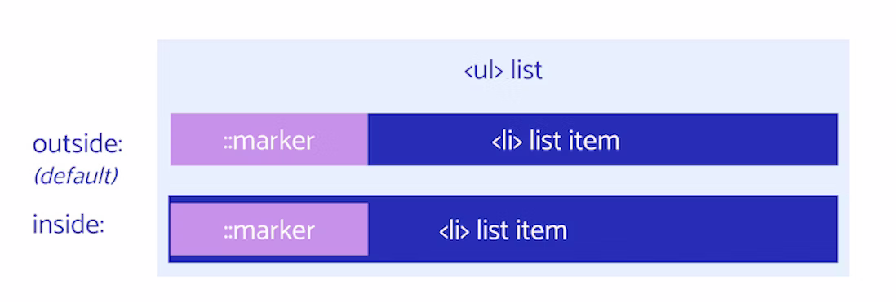
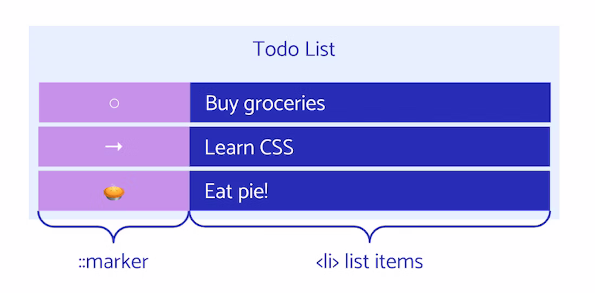

# Списки

<big>Структурно **список** состоит из элемента-контейнера списка, заполненного элементами списка. В этом модуле вы узнаете, как стилизовать все части списка.</big>

!!!info "CSS подкаст"

    030: Списки

    === "Перевод на русский"

    	<audio style="width: 100%;" controls src="/learn/css3/lists.ru.mp3"></audio>

    === "Английский оригинал"

    	<audio style="width: 100%;" controls src="/learn/css3/lists.en.ogg"></audio>

Представьте, что у вас есть набор товаров, которые вы планируете купить во время следующего похода за продуктами. Одним из распространенных способов визуального представления этого является список, но как добавить стиль в список продуктов?

```html
<ul>
    <li>oat milk</li>
    <li>rhubarb</li>
    <li>cereal</li>
    <li>pie crust</li>
</ul>
```

<iframe src="https://codepen.io/web-dot-dev/embed/zYzrEOW?height=500&amp;theme-id=light&amp;default-tab=result&amp;editable=true" style="height: 500px; width: 100%; border: 0;" loading="lazy"></iframe>

## Создание списка

Предыдущий список начинался с семантического элемента `<ul>`, дочерними элементами которого являются элементы списка продуктов (элементы `<li>`). Если проанализировать каждый элемент `<li>`, то можно увидеть, что все они имеют `display: list-item`, поэтому браузер по умолчанию отображает `::marker`.

```css
li {
    display: list-item;
}
```

Существуют еще два типа списков.

Упорядоченные списки могут быть созданы с помощью `<ol>`, в этом случае элемент списка будет отображать число в качестве `::marker`.

```html
<ol>
    <li>oat milk</li>
    <li>rhubarb</li>
    <li>cereal</li>
    <li>pie crust</li>
</ol>
```

А списки описаний создаются с помощью `<dl>`, однако в этом типе списка не используется элемент списка `<li>`.

```html
<dl>
    <dt>oat milk</dt>
    <dd>- non dairy trendy drink</dd>
    <dt>cereal</dt>
    <dd>- breakfast food</dd>
</dl>
```

<iframe src="https://codepen.io/web-dot-dev/embed/WNOrZNG?height=500&amp;theme-id=light&amp;default-tab=result&amp;editable=true" style="height: 500px; width: 100%; border: 0;" loading="lazy"></iframe>

## Стили списков

Теперь, когда вы знаете, как создать список, вы можете придать ему стиль. Первыми CSS-свойствами, с которыми следует познакомиться, являются те, которые применяются ко всему списку.

Существует три свойства стиля списка, которые можно использовать для оформления примера: `list-style-position`, `list-style-image` и `list-style-type`.

### `list-style-position`

[`list-style-position`](../../css/list-style-position.md) позволяет переместить точку маркера либо `inside`, либо `outside` содержимого элемента списка. По умолчанию `outside` означает, что точка не включается в содержимое элемента списка, в то время как `inside` перемещает первый элемент среди содержимого элемента списка.



<iframe src="https://codepen.io/web-dot-dev/embed/ExXPwxL?height=500&amp;theme-id=light&amp;default-tab=result&amp;editable=true" style="height: 500px; width: 100%; border: 0;" loading="lazy"></iframe>

### `list-style-image`

[`list-style-image`](../../css/list-style-image.md) позволяет заменять маркеры списка изображениями. Это позволяет задать изображение, например, `url` или `none`, чтобы сделать ваши маркеры изображением, даже svg или gif. Можно также использовать любой медиатип или даже URI данных.

Давайте рассмотрим, как можно добавить изображение каждого из наших продуктов в качестве `list-style-image`:

<iframe src="https://codepen.io/web-dot-dev/embed/GREoMgK?height=500&amp;theme-id=light&amp;default-tab=css%2Cresult&amp;editable=true" style="height: 500px; width: 100%; border: 0;" loading="lazy"></iframe>

!!!note ""

    Это свойство несколько ограничено в управлении положением, размером и т. д. маркера, поэтому мы рекомендуем использовать свойство [`::marker`](#marker-pseudo) для более настраиваемого подхода.

### `list-style-type`

Последним вариантом является стиль [`list-style-type`](../../css/list-style-type.md), который изменяет точки списка на известные ключевые слова маркера, пользовательские строки, emojis и т. д.

<iframe src="https://codepen.io/web-dot-dev/embed/jOwWGEy?height=500&amp;theme-id=light&amp;default-tab=css%2Cresult&amp;editable=true" style="height: 500px; width: 100%; border: 0;" loading="lazy"></iframe>

### Сокращенное свойство `list-style`

Теперь, когда у нас есть все эти индивидуальные свойства, мы можем использовать сокращение [`list-style`](../../css/list-style.md), чтобы задать все стили списка в одной строке:

```css
list-style: < 'list-style-type' > || < 'list-style-position'
    > || < 'list-style-image' >;
```

`list-style` позволяет объявлять комбинации из одного, двух или трех свойств `list-style` в любом порядке. Если заданы `list-style-type` и `list-style-image`, то `list-style-type` будет использоваться в качестве запасного варианта, если изображение недоступно.

```css
/* type */
list-style: square;

/* image */
list-style: url('../img/shape.png');

/* position */
list-style: inside;

/* type | position */
list-style: georgian inside;

/* type | image | position */
list-style: lower-roman url('../img/shape.png') outside;

/* Keyword value */
list-style: none;

/* Global values */
list-style: inherit;
list-style: initial;
list-style: revert;
list-style: unset;
```

Это наиболее часто используемое свойство стилей списка, рассматриваемых в данном разделе. Часто используется `list-style: none` для скрытия стилей по умолчанию. Стили по умолчанию приходят из браузера, и часто можно увидеть сброшенные таблицы стилей, удаляющие такие стили списка, как `padding` и `margin`. Можно также использовать это сокращение для установки стилей, например `list-style: square inside;`.

<iframe src="https://codepen.io/web-dot-dev/embed/eYRJGme?height=500&amp;theme-id=light&amp;default-tab=result&amp;editable=true" style="height: 500px; width: 100%; border: 0;" loading="lazy"></iframe>

До сих пор в примерах рассматривалась стилизация всего списка и его элементов, но как насчет более детального подхода?

## Псевдоэлемент `::marker` {#marker-pseudo}

Маркерный элемент `list-item` — это пуля, дефис или римская цифра, которые помогают обозначить каждый элемент списка.



Если просмотреть список в DevTools, то можно увидеть элемент `::marker` для каждого из элементов списка, несмотря на то, что в HTML он не объявлен. При дальнейшем рассмотрении элемента `::marker` можно увидеть его стилизацию по умолчанию в браузере.

```css
::marker {
    unicode-bidi: isolate;
    font-variant-numeric: tabular-nums;
    text-transform: none;
    text-indent: 0px !important;
    text-align: start !important;
    text-align-last: start !important;
}
```

При объявлении списка каждому элементу присваивается маркер, несмотря на то, что в HTML нет ни буллитов, ни римских цифр. Это псевдоэлемент, поскольку браузер генерирует его за вас и предоставляет ограниченный API для его стилизации. [Подробнее об анатомии CSS-маркеров.](https://web.dev/css-marker-pseudo-element/) `::marker` в настоящее время имеет [ограниченную поддержку](../../css/marker.md) в Safari.

### Блок маркера

В модели CSS-макета маркеры элементов списка представлены блоком маркера, связанным с каждым элементом списка. Блок маркера — это контейнер, в котором обычно содержится пуля или номер.

Для стилизации блока маркеров можно использовать селектор `::marker`. Это позволяет выбрать только маркер, а не стилизовать весь список.

<iframe src="https://codepen.io/web-dot-dev/embed/jOwWGPy?height=500&amp;theme-id=light&amp;default-tab=css%2Cresult&amp;editable=true" style="height: 500px; width: 100%; border: 0;" loading="lazy"></iframe>

!!!note "Примечание"

    Элементы `::marker` предшествуют любым псевдоэлементам, которые вы могли вставить с помощью CSS `::before`.

### Стили маркера

Теперь, когда вы выбрали маркер, давайте рассмотрим свойства стиля, доступные для этого селектора.

Существует довольно много разрешенных CSS `::marker` свойств:

-   `animation-*`
-   `transition-*`
-   `color`
-   `direction`
-   `font-*`
-   `content`
-   `unicode-bidi`
-   `white-space`

<iframe src="https://codepen.io/web-dot-dev/embed/eYRJGNy?height=500&amp;theme-id=light&amp;default-tab=result&amp;editable=true" style="height: 500px; width: 100%; border: 0;" loading="lazy"></iframe>

!!!note ""

    В упорядоченных списках пули по умолчанию являются цифрами. Значение содержимого `::marker` является вариантом использования [counters](https://developer.mozilla.org/docs/Web/CSS/CSS_Lists_and_Counters/Using_CSS_counters) для создания пользовательской нумерации.

## Тип отображения

Все наши свойства `list-style` и `::marker` знают, как стилизовать элементы `<li>`, поскольку по умолчанию они имеют значение `list-item`. Вы также можете превратить в элемент списка то, что не является `<li>`.

Для этого нужно добавить свойство `display: list-item`. Один из примеров использования свойства `display: list-item` — если вы хотите, чтобы в заголовке был висячий маркер, который можно изменить на что-то другое с помощью `::marker`. В следующем примере показан заголовок, использующий `display: list-item` для стилизации, и список, использующий корректную разметку списка ниже.

<iframe src="https://codepen.io/web-dot-dev/embed/ExXPwjR?height=500&amp;theme-id=light&amp;default-tab=css%2Cresult&amp;editable=true" style="height: 500px; width: 100%; border: 0;" loading="lazy"></iframe>

Хотя с помощью `display` можно превратить что угодно в элемент списка, не следует использовать это вместо корректной разметки списка, если содержимое, которое вы стилизуете, действительно является списком. Изменение внешнего вида элемента на элемент списка не меняет того, как сервисы доступности читают и распознают этот элемент, поэтому он не будет читаться как элемент списка устройствами чтения с экрана или переключателями. Всегда используйте семантическую разметку и создавайте списки с помощью `<li>`, когда это возможно.

## Ресурсы

-   [MDN Руководство по стилизации списков](https://developer.mozilla.org/docs/Learn/CSS/Styling_text/Styling_lists)
-   [Пользовательские маркеры с помощью CSS ::marker](https://web.dev/css-marker-pseudo-element/)
-   [Smashing Magazine: CSS списки, маркеры и счетчики](https://www.smashingmagazine.com/2019/07/css-lists-markers-counters/)
-   [MDN Использование CSS-счетчиков](https://developer.mozilla.org/docs/Web/CSS/CSS_Lists_and_Counters/Using_CSS_counters)
-   [CSS Списки и счетчики Модуль Уровень 3](https://www.w3.org/TR/css-lists-3/)
-   [CSS-Tricks: Counting With CSS Counters и CSS Grid](https://css-tricks.com/counting-css-counters-css-grid/)

:material-information-outline: Источник &mdash; [Lists](https://web.dev/learn/css/lists/)
