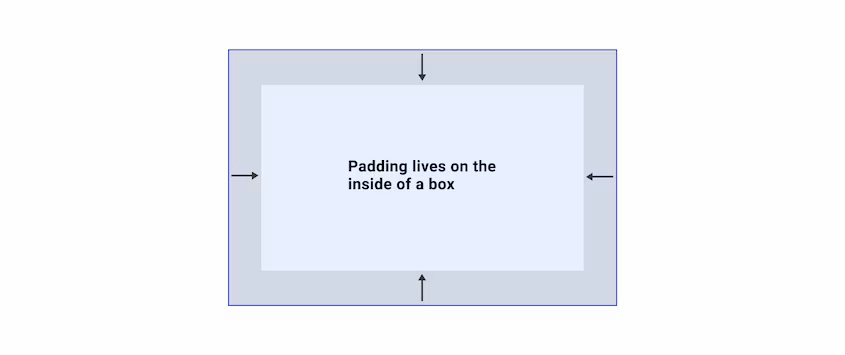
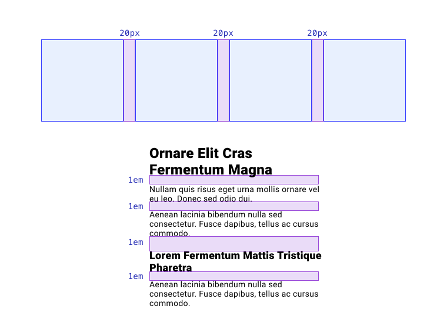

# Интервалы

<big>Узнайте, как выбрать оптимальный способ расстановки элементов с учетом используемого метода компоновки и компонента, который необходимо собрать.</big>

!!!info "CSS подкаст"

    013: Интервалы

    === "Перевод на русский"

    	<audio style="width: 100%;" controls src="/learn/css3/spacing.ru.mp3"></audio>

    === "Английский оригинал"

    	<audio style="width: 100%;" controls src="/learn/css3/spacing.en.ogg"></audio>

Допустим, у вас есть коллекция из трех блоков, поставленных друг на друга, и вам нужно пространство между ними. Сколько способов сделать это в CSS вы можете придумать?


Свойство `margin` _может_ дать то, что вам нужно, но оно также может добавить дополнительные интервалы, которые вам не нужны. Например, как можно указать только пространство _между_ каждым из этих элементов? В этом случае более уместным будет что-то вроде `gap`. Существует множество способов настройки интервалов в пользовательском интерфейсе, каждый из которых имеет свои преимущества и недостатки.

## HTML интервалы

HTML сам по себе предоставляет некоторые методы для расстановки элементов. Элементы `<br>` и `<hr>` позволяют размещать элементы в направлении блока, что в латинском языке означает "сверху вниз".

При использовании элемента `<br>` создается разрыв строки, как при нажатии клавиши Enter в текстовом процессоре.

Элемент `<hr>` создает горизонтальную линию с пробелами по обеим сторонам, называемыми `margin`.

<iframe src="https://codepen.io/web-dot-dev/embed/dyNRJQg?height=500&amp;theme-id=light&amp;default-tab=result&amp;editable=true" style="height: 500px; width: 100%; border: 0;" loading="lazy"></iframe>

Наряду с использованием HTML-элементов, пространство может быть создано с помощью HTML _сущностей_. HTML-сущность — это зарезервированная строка символов, которая заменяется браузером на символьные сущности. Например, если в HTML-файле набрать `&copy;`, то он будет преобразован в символ ©. Сущность `&nbsp;` преобразуется в символ неразрывного пробела, который обеспечивает строчный пробел. Однако будьте осторожны, поскольку неразрывность этого символа сшивает два элемента вместе, что может привести к странному поведению.

!!!note ""

    Используйте HTML-элементы для добавления пространства только в тех случаях, когда этот элемент помогает понять суть документа. Например, `<hr>` не просто добавляет пространство, а создает логическое разделение двух фрагментов содержимого. Если вам нужна просто строка с пространством вокруг нее, то добавление границы с помощью CSS может быть более уместным.

## Margin

Если необходимо добавить пространство за пределами элемента, используется свойство `margin`. Margin — это как подушка вокруг элемента. Свойство `margin` — это сокращение для обозначения `margin-top`, `margin-right`, `margin-bottom` и `margin-left`.


Сокращение `margin` применяет свойства в определенном порядке: сверху, справа, снизу и слева. Запомнить их можно с трудом: TRouBLe.


Сокращение `margin` также может быть использовано с одним, двумя или тремя значениями. Добавление четвертого значения позволяет задать каждую отдельную сторону. Они применяются следующим образом:

-   Одно значение будет применяться ко всем сторонам. (`margin: 20px`).
-   Два значения: первое значение будет применяться к верхней и нижней сторонам, а второе — к левой и правой. (`margin: 20px 40px`).
-   Три значения: первое значение — `top`, второе значение — `left` **и** `right`, третье значение — `bottom`. (`margin: 20px 40px 30px`).

<iframe src="https://codepen.io/web-dot-dev/embed/abpwqyQ?height=500&amp;theme-id=light&amp;default-tab=result&amp;editable=true" style="height: 500px; width: 100%; border: 0;" loading="lazy"></iframe>

Margin может быть задан в виде длины, процента или автоматического значения, например `1em` или `20%`. Если вы используете процентное значение, то оно будет рассчитываться на основе ширины содержащего блока вашего элемента.

Это означает, что если ширина блока, содержащего элемент, составляет `250px`, а значение `margin` для элемента равно `20%`, то каждая сторона элемента будет иметь вычисляемый отступ в `50px`.

<iframe src="https://codepen.io/web-dot-dev/embed/YzNQeyb?height=500&amp;theme-id=light&amp;default-tab=result&amp;editable=true" style="height: 500px; width: 100%; border: 0;" loading="lazy"></iframe>

Для поля можно также использовать значение `auto`. Для элементов уровня блока с ограниченным размером `auto` margin будет занимать свободное пространство в том направлении, к которому он применяется. Хорошим примером является этот пример из модуля [Flexbox](flexbox.md), где элементы отталкиваются друг от друга.

<iframe src="https://codepen.io/web-dot-dev/embed/poRELbR?height=500&amp;theme-id=light&amp;default-tab=result&amp;editable=true" style="height: 500px; width: 100%; border: 0;" loading="lazy"></iframe>

Другой хороший пример `auto` поля — горизонтально центрированная обертка, имеющая максимальную ширину. Такая обертка часто используется для создания последовательной центральной колонки на сайте.

```css
.wrapper {
    max-width: 400px;
    margin: 0 auto;
}
```

<iframe src="https://codepen.io/web-dot-dev/embed/XWpgZKq?height=500&amp;theme-id=light&amp;default-tab=result&amp;editable=true" style="height: 300px; width: 100%; border: 0;" loading="lazy"></iframe>

Здесь margin удаляется с верхней и нижней (блочной) сторон, а `auto` делит пространство между левой и правой (инлайн) сторонами.

!!!note ""

    В предыдущем модуле по [логическим свойствам](logical-properties.md) вы узнали, что вместо указания `margin-top`, `margin-right`, `margin-bottom` и `margin-left` можно использовать `margin-block-start`, `margin-inline-end`, `margin-block-end` и `margin-inline-start`.

### Отрицательный маржин

Отрицательные значения также могут использоваться для margin. Вместо того чтобы добавлять пространство между соседними элементами, оно будет **уменьшать пространство** между ними. Это может привести к перекрытию элементов, если объявить отрицательное значение, превышающее доступное пространство.

<iframe src="https://codepen.io/web-dot-dev/embed/YzNQeLP?height=500&amp;theme-id=light&amp;default-tab=result&amp;editable=true" style="height: 400px; width: 100%; border: 0;" loading="lazy"></iframe>

### Схлопывание полей

Схлопывание полей — понятие непростое, но с ним часто приходится сталкиваться при создании интерфейсов. Допустим, у вас есть два элемента: заголовок и абзац, которые оба имеют вертикальное поле:

```html
<article>
    <h1>My heading with teal margin</h1>
    <p>
        A paragraph of text that has blue margin on it,
        following the heading with margin.
    </p>
</article>
```

---

```css
h1 {
    margin-bottom: 2rem;
}

p {
    margin-top: 3rem;
}
```

<iframe src="https://codepen.io/web-dot-dev/embed/OJWgvMx?height=500&amp;theme-id=light&amp;default-tab=result&amp;editable=true" style="height: 500px; width: 100%; border: 0;" loading="lazy"></iframe>

На первый взгляд можно подумать, что абзац будет отстоять от заголовка на `5em`, поскольку `2rem` и `3rem` в сумме дают `5rem`. Однако из-за того, что **вертикальное поле схлопывается**, на самом деле расстояние составляет `3rem`.

Схлопывание полей происходит путем выбора наибольшего значения из двух смежных элементов с вертикальным отступом, установленным на смежных сторонах. Нижняя часть `h1` пересекается с верхней частью `p`, поэтому выбирается наибольшее значение нижнего поля `h1` и верхнего поля `p`. Если бы у `h1` было `3.5rem` нижнего поля, то пространство между ними было бы `3.5rem`, поскольку оно больше `3rem`. Разрушаются только поля блоков, но не поля строк (горизонтальные).

!!!note ""

    Это поведение уходит корнями в те времена, когда в Интернете были только документы. Схлопывание полей помогает установить согласованное расстояние между элементами, не создавая случайно огромных зазоров между элементами, у которых также определены поля.

Схлопывание полей также помогает при работе с пустыми элементами. Если у вас есть абзац, верхнее и нижнее поля которого равны `20px`, то он создаст только `20px` пространства, а не `40px`. Если же внутри этого элемента добавить _любые_ элементы, включая `padding`, то его поле больше не будет схлопываться само по себе и будет восприниматься как любой блок с содержимым.

#### Предотвращение схлопывания полей

Если сделать элемент абсолютно позиционированным, используя `position: absolute`, то margin больше не будет схлопываться. При использовании свойства `float` margin также не будет схлопываться.

Если между двумя элементами с блочным полем находится элемент без поля, то поле также не будет схлопываться, поскольку два элемента с блочным полем уже не являются смежными братьями и сестрами, а просто родными.

<iframe src="https://codepen.io/web-dot-dev/embed/YzNQavQ?height=500&amp;theme-id=light&amp;default-tab=result&amp;editable=true" style="height: 400px; width: 100%; border: 0;" loading="lazy"></iframe>

В уроке [Разметка](layout.md) вы узнали, что контейнеры flexbox и grid очень похожи на блочные контейнеры, но совершенно по-разному работают со своими дочерними элементами. Так же обстоит дело и с margin collapse.

Если мы возьмем исходный пример из урока и применим flexbox с направлением колонок, то поля будут объединены, а не свернуты. Это может обеспечить предсказуемость работы с макетом, для чего и предназначены контейнеры flexbox и grid.

<iframe src="https://codepen.io/web-dot-dev/embed/QWdgmNx?height=500&amp;theme-id=light&amp;default-tab=result&amp;editable=true" style="height: 500px; width: 100%; border: 0;" loading="lazy"></iframe>

Поля и схлопывание полей могут быть сложными для понимания, но понимание того, как они работают, в деталях очень полезно, поэтому [это подробное объяснение](https://www.smashingmagazine.com/2019/07/margins-in-css) настоятельно рекомендуется.

## Отступы

Вместо того чтобы создавать пространство снаружи блока, как это делает `margin`, свойство `padding` создает пространство **внутри** блока: как изоляция.



В зависимости от того, какую модель блока вы используете, что было рассмотрено еще в уроке [box model](box-model.md), `padding` может также влиять на общие размеры элемента.

<iframe src="https://codepen.io/web-dot-dev/embed/eYgRrzz?height=500&amp;theme-id=light&amp;default-tab=result&amp;editable=true" style="height: 500px; width: 100%; border: 0;" loading="lazy"></iframe>

Свойство `padding` является сокращением для обозначения `padding-top`, `padding-right`, `padding-bottom` и `padding-left`. Как и `margin`, `padding` также имеет логические свойства: `padding-block-start`, `padding-inline-end`, `padding-block-end` и `padding-inline-start`.

## Позиционирование

Также в модуле [layout](layout.md) описано, что если задать для `position` значение, отличное от `static`, то элементы можно расположить в пространстве с помощью свойств `top`, `right`, `bottom` и `left`. В поведении этих направленных значений есть некоторые различия:

-   Элемент со свойством `position: relative` будет сохранять свое место в потоке документов, даже когда вы установите эти значения. Они также будут относительны к позиции вашего элемента.
-   Элемент с `position: absolute` будет основывать значения направления на позиции относительного родителя.
-   Элемент с `position: fixed` будет основывать значения направления на области просмотра.
-   Элемент с `position: sticky` будет применять значения направления только в том случае, если он находится в пристыкованном/застывшем состоянии.

<iframe src="https://codepen.io/web-dot-dev/embed/NWdNGZB?height=500&amp;theme-id=light&amp;default-tab=result&amp;editable=true" style="height: 500px; width: 100%; border: 0;" loading="lazy"></iframe>

В модуле [Логические свойства](logical-properties.md) рассказывается о свойствах `inset-block` и `inset-inline`, которые позволяют задавать направленные значения, учитывающие режим записи.

Оба свойства являются сокращением, объединяющим значения `start` и `end`, и поэтому могут принимать либо одно значение для `start` и `end`, либо два отдельных значения.

## Grid и flexbox

Наконец, и в сетке, и в flexbox можно использовать свойство `gap` для создания пространства _между_ дочерними элементами. Свойство `gap` является сокращением для `row-gap` и `column-gap`, оно принимает одно или два значения, которые могут быть длиной или процентами. Можно также использовать такие ключевые слова, как `unset`, `initial` и `inherit`. Если задать только одно значение, то один и тот же `gap` будет применяться и к строкам, и к столбцам, если же задать оба значения, то первое значение будет `row-gap`, а второе — `column-gap`.

Как с помощью flexbox, так и с помощью grid можно также создавать пространство, используя их возможности распределения и выравнивания, которые мы рассматриваем в модуле [grid](grid.md) и в модуле [flexbox](flexbox.md).


## Создание согласованных интервалов

Очень хорошо выбрать стратегию и придерживаться ее, чтобы создать последовательный пользовательский интерфейс с хорошим потоком и ритмом. Хорошим способом достижения этой цели является использование последовательных мер для интервалов.

Например, можно взять на себя обязательство использовать `20px` в качестве единой меры для всех промежутков между элементами — так называемых "желобов", — чтобы все макеты выглядели и воспринимались единообразно. Можно также использовать `1em` в качестве вертикального интервала между содержимым потока, что позволит добиться согласованности интервалов в зависимости от размера шрифта элемента. Что бы вы ни выбрали, вам следует сохранить эти значения в виде переменных (или пользовательских свойств CSS), чтобы обозначить их и упростить процесс согласования.



```css
:root {
    --gutter: 20px;
    --spacing: 1em;
}

h1 {
    margin-left: var(--gutter);
    margin-top: var(--spacing);
}
```

Подобное использование пользовательских свойств позволяет определить их один раз и затем использовать во всем CSS. При их обновлении, как локальном в элементе, так и глобальном, значения будут передаваться вниз по каскаду, и обновленные значения будут отражаться.

:material-information-outline: Источник: [Spacing](https://web.dev/learn/css/spacing/)
