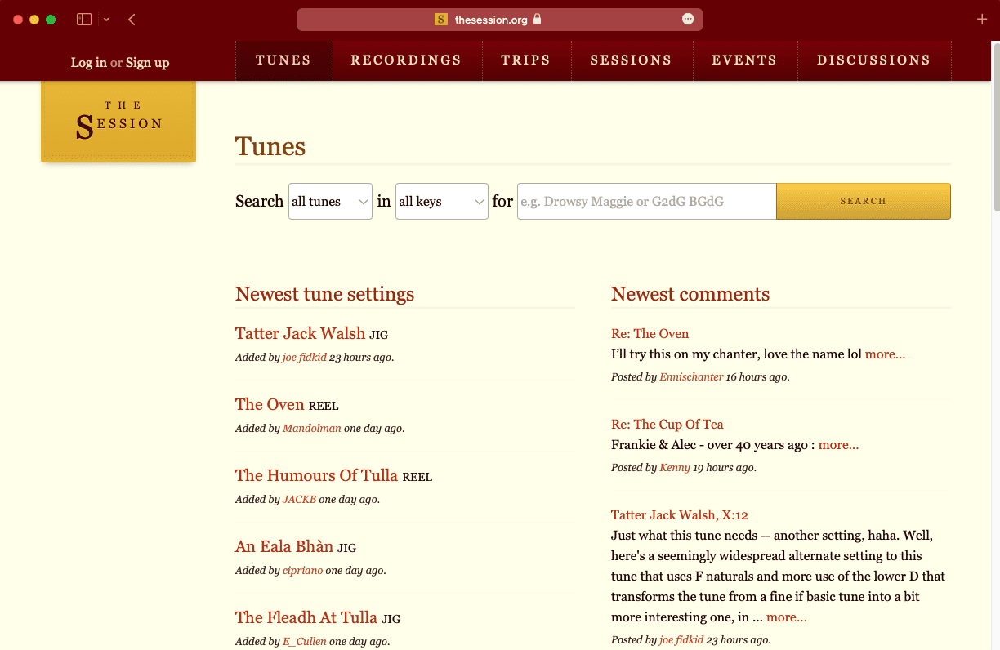
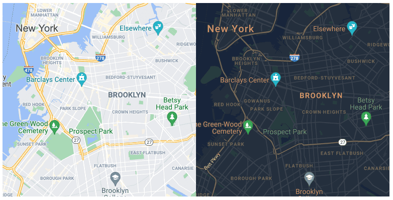

# Темизация

Даже брендинг может быть адаптивным. Вы можете настроить представление своего сайта в соответствии с предпочтениями пользователя. Но сначала о том, как расширить брендинг сайта, включив в него сам браузер.

## Настройка интерфейса браузера

Некоторые браузеры позволяют предложить цвет темы, основанный на палитре вашего сайта. При этом интерфейс браузера адаптируется к предложенному цвету. Добавьте цвет в элемент `meta` с именем `theme-color` в `head` ваших страниц.

```html
<meta name="theme-color" content="#00D494" />
```

!!!note ""

    Немного странно размещать подобную информацию о стиле в HTML, а не в CSS, но это позволяет браузеру обновлять свой интерфейс сразу после загрузки страницы, а не дожидаться CSS.

<figure>



<figcaption>В браузере Safari просматриваются три веб-сайта. Каждый из них имеет свой собственный цвет темы, распространяющийся на интерфейс браузера.</figcaption>
</figure>

Вы можете обновлять значение `theme-color` с помощью JavaScript. Но используйте эту возможность с умом. Слишком частая смена цветовой схемы браузера может привести к раздражению пользователей. Подумайте о более тонких способах изменения цвета темы. Если изменения будут слишком резкими, пользователи будут уходить, раздражаясь.

Цвет темы можно также задать в файле [web app manifest](https://developer.mozilla.org/docs/Web/Manifest). Это JSON-файл, содержащий метаданные о вашем сайте.

Ссылайтесь на файл манифеста в `head` своих документов. Используйте элемент `link` со значением `rel`, равным `manifest`.

```html
<link rel="manifest" href="/manifest.json" />
```

В файле манифеста перечислите свои метаданные, используя пары ключ/значение.

```json
{
    "short_name": "Clearleft",
    "name": "Clearleft design agency",
    "start_url": "/",
    "background_color": "#00D494",
    "theme_color": "#00D494",
    "display": "standalone"
}
```

Если посетитель решит добавить ваш сайт на домашний экран, браузер будет использовать информацию из вашего файла манифеста для отображения соответствующего ярлыка.

!!!note ""

    Узнайте больше о том, как [добавить манифест веб-приложения](https://web.dev/articles/add-manifest).

## Обеспечение темного режима

Многие операционные системы позволяют пользователям указывать предпочтение светлой или темной цветовой палитры, что является хорошей идеей для оптимизации сайта в соответствии с тематическими предпочтениями пользователя. Получить доступ к этим предпочтениям можно с помощью медиафункции `prefers-color-scheme`.

```css
@media (prefers-color-scheme: dark) {
  // Styles for a dark theme.
}
```

<iframe allow="camera; clipboard-read; clipboard-write; encrypted-media; geolocation; microphone; midi;" loading="lazy" src="https://codepen.io/web-dot-dev/embed/wvrwLgN?height=400&amp;theme-id=dark&amp;default-tab=css%2C%20result&amp;editable=true" style="height: 400px; width: 100%; border: 0;" data-title="Pen wvrwLgN by web-dot-dev on Codepen"></iframe>

<video controls loop>
<source src="/learn/design/theming-4.mp4" />
</video>

Укажите цвета темы с помощью медиафункции `prefers-color-scheme` в элементе `meta`.

```html
<meta
    name="theme-color"
    content="#ffffff"
    media="(prefers-color-scheme: light)"
/>
<meta
    name="theme-color"
    content="#000000"
    media="(prefers-color-scheme: dark)"
/>
```

Также можно использовать медиафункцию `prefers-color-scheme` внутри SVG. Если вы используете SVG-файл для своего фавикона, его можно настроить для темного режима. Томас Штайнер писал о [`prefers-color-scheme` в SVG-фавиконах для темного режима](https://blog.tomayac.com/2019/09/21/prefers-color-scheme-in-svg-favicons-for-dark-mode-icons/).

## Темизация с помощью пользовательских свойств

Если вы используете одни и те же значения цветов в разных местах CSS, то повторять все селекторы в медиазапросе `prefers-color-scheme` может быть довольно утомительно.

```css
body {
    background-color: white;
    color: black;
}
input {
    background-color: white;
    color: black;
    border-color: black;
}
button {
    background-color: black;
    color: white;
}
@media (prefers-color-scheme: dark) {
    body {
        background-color: black;
        color: white;
    }
    input {
        background-color: black;
        color: white;
        border-color: white;
    }
    button {
        background-color: white;
        color: black;
    }
}
```

Используйте пользовательские свойства CSS для хранения значений цветов. Пользовательские свойства работают подобно переменным в языке программирования. Можно обновлять значение переменной без изменения ее имени.

Если обновлять значения пользовательских свойств в медиазапросе `prefers-color-scheme`, то не придется дважды писать все селекторы.

```css
html {
    --page-color: white;
    --ink-color: black;
}
@media (prefers-color-scheme: dark) {
    html {
        --page-color: black;
        --ink-color: white;
    }
}
body {
    background-color: var(--page-color);
    color: var(--ink-color);
}
input {
    background-color: var(--page-color);
    color: var(--ink-color);
    border-color: var(--ink-color);
}
button {
    background-color: var(--ink-color);
    color: var(--page-color);
}
```

<iframe allow="camera; clipboard-read; clipboard-write; encrypted-media; geolocation; microphone; midi;" loading="lazy" src="https://codepen.io/web-dot-dev/embed/qBPWzrj?height=440&amp;theme-id=dark&amp;default-tab=css%2Cresult&amp;editable=true" style="height: 440px; width: 100%; border: 0;" data-title="Pen qBPWzrj by web-dot-dev on Codepen"></iframe>

Более продвинутые примеры тематизации с помощью пользовательских свойств см. в разделе [Построение цветовой схемы](https://web.dev/articles/building/a-color-scheme).

## Изображения

Если в HTML используются SVG-изображения, то и к ним можно применять пользовательские свойства.

```css
svg {
    stroke: var(--ink-color);
    fill: var(--page-color);
}
```

Теперь ваши значки будут менять свой цвет вместе с другими элементами на странице.

Если необходимо уменьшить яркость фотографических изображений при отображении в темном режиме, можно применить фильтр в CSS.

```css
@media (prefers-color-scheme: dark) {
    img {
        filter: brightness(0.8) contrast(1.2);
    }
}
```

<iframe allow="camera; clipboard-read; clipboard-write; encrypted-media; geolocation; microphone; midi;" loading="lazy" src="https://codepen.io/web-dot-dev/embed/PoJYrpy?height=600&amp;theme-id=dark&amp;default-tab=result&amp;editable=true" style="height: 600px; width: 100%; border: 0;" data-title="Pen PoJYrpy by web-dot-dev on Codepen"></iframe>

<figure>


<figcaption>Эффект малозаметен, но в темном режиме можно уменьшить яркость изображений.</figcaption>
</figure>

Для некоторых изображений можно полностью поменять их местами в темном режиме. Например, можно показать карту с более темной цветовой схемой. Для этого используйте элемент `<picture>`, содержащий элемент `<source>` с медиазапросом `prefers-color-scheme`.

```html
<picture>
    <source
        srcset="darkimage.png"
        media="(prefers-color-scheme: dark)"
    />
    
</picture>
```

<iframe allow="camera; clipboard-read; clipboard-write; encrypted-media; geolocation; microphone; midi;" loading="lazy" src="https://codepen.io/web-dot-dev/embed/MWEgMmw?height=600&amp;theme-id=dark&amp;default-tab=html%2Cresult&amp;editable=true" style="height: 600px; width: 100%; border: 0;" data-title="Pen MWEgMmw by web-dot-dev on Codepen"></iframe>

<video controls loop>
<source src="/learn/design/theming-7.mp4" />
</video>

<figure>

<figcaption>Две версии одной и той же карты, одна для светлого режима, другая для темного.</figcaption>
</figure>

## Формы

Браузеры предоставляют цветовую палитру по умолчанию для полей форм. Сообщите браузеру, что на вашем сайте есть темный и светлый режимы. Таким образом, браузер сможет задать соответствующий стиль по умолчанию для форм.

Добавьте это в свой CSS:

```css
html {
    color-scheme: light;
}
@media (prefers-color-scheme: dark) {
    html {
        color-scheme: dark;
    }
}
```

Можно также использовать HTML. Добавьте это в `head` ваших документов:

```html
<meta name="supported-color-schemes" content="light dark" />
```

<iframe allow="camera; clipboard-read; clipboard-write; encrypted-media; geolocation; microphone; midi;" loading="lazy" src="https://codepen.io/web-dot-dev/embed/dyVbBWZ?height=400&amp;theme-id=dark&amp;default-tab=result&amp;editable=true" style="height: 400px; width: 100%; border: 0;" data-title="Pen dyVbBWZ by web-dot-dev on Codepen"></iframe>

<video controls loop>
<source src="/learn/design/theming-9.mp4" />
</video>

Используйте свойство [`accent-color`](https://web.dev/articles/accent-color) в CSS для стилизации флажков, радиокнопок и некоторых других полей формы.

```css
html {
    accent-color: red;
}
```

Обычно в темных темах используются приглушенные фирменные цвета. Вы можете обновить значение `accent-color` для темного режима.

```css
html {
    accent-color: red;
}
@media (prefers-color-scheme: dark) {
    html {
        accent-color: pink;
    }
}
```

Для этого имеет смысл использовать пользовательское свойство, чтобы можно было хранить все объявления цветов в одном месте.

```css
html {
    color-scheme: light;
    --page-color: white;
    --ink-color: black;
    --highlight-color: red;
}
@media (prefers-color-scheme: dark) {
    html {
        color-scheme: dark;
        --page-color: black;
        --ink-color: white;
        --highlight-color: pink;
    }
}
html {
    accent-color: var(--highlight-color);
}
body {
    background-color: var(--page-color);
    color: var(--ink-color);
}
```

<iframe allow="camera; clipboard-read; clipboard-write; encrypted-media; geolocation; microphone; midi;" loading="lazy" src="https://codepen.io/web-dot-dev/embed/WNZeqjB?height=400&amp;theme-id=dark&amp;default-tab=result&amp;editable=true" style="height: 400px; width: 100%; border: 0;" data-title="Pen WNZeqjB by web-dot-dev on Codepen"></iframe>

<video controls loop>
<source src="/learn/design/theming-10.mp4" />
</video>

!!!note ""

    Подробнее об окрашивании элементов в цвета темы см. в разделе [more tinting](https://web.dev/articles/accent-color#extra-more-tinting).

Предоставление темного режима - это лишь один из примеров адаптации сайта к предпочтениям пользователя. Далее вы узнаете, как сделать сайт адаптируемым к всевозможным требованиям [accessibility](accessibility.md).
