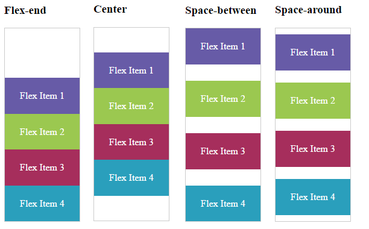

# Выравнивание элементов. justify-content

Иногда мы можем сталкиваться с тем, что пространство flex-контейнеров по размеру отличается от пространства, необходимого для flex-элементов. Например:

-   flex-элементы не используют все пространство flex-контейнера
-   flex-элементам требуется большее пространство, чем доступно во flex-контейнере. В этом случае элементы выходят за пределы контейнера.

Для управления этими ситуациями мы можем применять свойство `justify-content`. Оно выравнивает элементы вдоль основной оси - main axis (при расположении в виде строки по горизонтали, при расположении в виде столбца - по вертикали) и принимает следующие значения:

-   `flex-start`: значение по умолчанию, при котором первый элемент выравнивается по левому краю контейнера(при расположении в виде строки) или по верху (при расположении в виде столбца), за ним располагается второй элемент и так далее.
-   `flex-end`: последний элемент выравнивается по правому краю (при расположении в виде строки) или по низу (при расположении в виде столбца) контейнера, за ним выравнивается предпоследний элемент и так далее
-   `center`: элементы выравниваются по центру
-   `space-between`: если в стоке только один элемент или элементы выходят за границы flex-контейнера, то данное значение аналогично `flex-start`. В остальных случаях первый элемент выравнивается по левому краю (при расположении в виде строки) или по верху (при расположении в виде столбца), а последний элемент - по правому краю контейнера (при расположении в виде строки) или по низу (при расположении в виде столбца). Все оставшееся пространство между ними равным образом распределяется между остальными элементами
-   `space-around`: если в строке только один элемент или элементы выходят за пределы контейнера, то его действие аналогично значению `center`. В ином случае элементы равным образом распределяют пространство между левым и правым краем контейнера, а расстояние между первым и последним элементом и границами контейнера составляет половину расстояния между элементами.

Выравнивание для расположения элементов в виде строки:

```html
<!doctype html>
<html>
    <head>
        <meta charset="utf-8" />
        <title>Flexbox в CSS3</title>
        <style>
            .flex-container {
                display: flex;
                border: 1px #ccc solid;
            }
            .flex-end {
                justify-content: flex-end;
            }
            .center {
                justify-content: center;
            }
            .space-between {
                justify-content: space-between;
            }
            .space-around {
                justify-content: space-around;
            }
            .flex-item {
                text-align: center;
                font-size: 1em;
                padding: 1.5em;
                color: white;
            }
            .color1 {
                background-color: #675ba7;
            }
            .color2 {
                background-color: #9bc850;
            }
            .color3 {
                background-color: #a62e5c;
            }
            .color4 {
                background-color: #2a9fbc;
            }
            .color5 {
                background-color: #f15b2a;
            }
        </style>
    </head>
    <body>
        <h3>Flex-end</h3>
        <div class="flex-container flex-end">
            <div class="flex-item color1">Flex Item 1</div>
            <div class="flex-item color2">Flex Item 2</div>
            <div class="flex-item color3">Flex Item 3</div>
            <div class="flex-item color4">Flex Item 4</div>
        </div>
        <h3>Center</h3>
        <div class="flex-container center">
            <div class="flex-item color1">Flex Item 1</div>
            <div class="flex-item color2">Flex Item 2</div>
            <div class="flex-item color3">Flex Item 3</div>
            <div class="flex-item color4">Flex Item 4</div>
        </div>
        <h3>Space-between</h3>
        <div class="flex-container space-between">
            <div class="flex-item color1">Flex Item 1</div>
            <div class="flex-item color2">Flex Item 2</div>
            <div class="flex-item color3">Flex Item 3</div>
            <div class="flex-item color4">Flex Item 4</div>
        </div>
        <h3>Space-around</h3>
        <div class="flex-container space-around">
            <div class="flex-item color1">Flex Item 1</div>
            <div class="flex-item color2">Flex Item 2</div>
            <div class="flex-item color3">Flex Item 3</div>
            <div class="flex-item color4">Flex Item 4</div>
        </div>
    </body>
</html>
```


Выравнивание при расположении в виде столбцов:



## См. также

-   [justify-content](../../css/justify-content.md)
