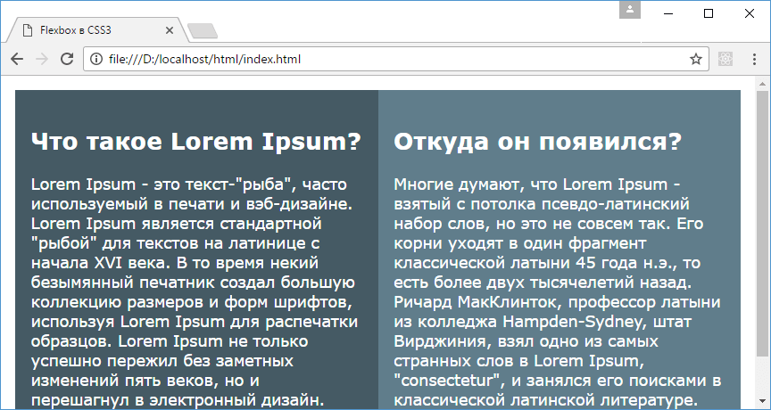
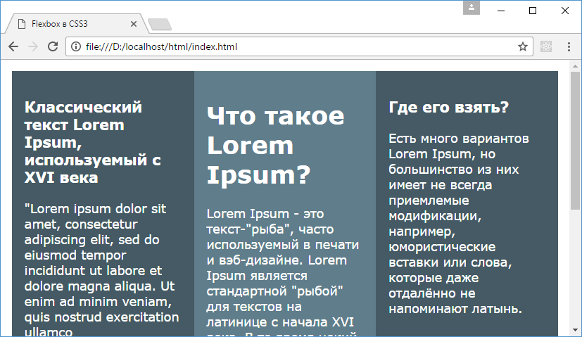

# Многоколоночный дизайн на Flexbox

Рассмотрим, как сделать простейшие многоколонночные макеты страницы с помощью Flexbox.

## Двуколоночный дизайн

```html
<!doctype html>
<html>
    <head>
        <meta charset="utf-8" />
        <title>Flexbox в CSS3</title>
        <style>
            * {
                box-sizing: border-box;
            }
            html,
            body {
                padding: 0;
                margin: 0;
                font-family: verdana, arial, sans-serif;
            }

            body {
                display: flex;
                padding: 1em;
                flex-direction: column;
            }

            .item {
                background-color: #455a64;
                color: #fff;
                font-size: 1.1em;
                padding: 1em;
            }

            .item:nth-child(even) {
                background-color: #607d8b;
            }
            @media screen and (min-width: 600px) {
                body {
                    flex-direction: row;
                }
            }
        </style>
    </head>
    <body>
        <div class="item">
            <h2>Что такое Lorem Ipsum?</h2>
            <p>
                Lorem Ipsum - это текст-"рыба", часто
                используемый в печати и вэб-дизайне. Lorem
                Ipsum является стандартной "рыбой" для
                текстов на латинице с начала XVI века...
            </p>
        </div>

        <div class="item">
            <h2>Откуда он появился?</h2>
            <p>
                Многие думают, что Lorem Ipsum - взятый с
                потолка псевдо-латинский набор слов, но это
                не совсем так. Его корни уходят в один
                фрагмент классической латыни 45 года н.э...
            </p>
        </div>
    </body>
</html>
```

Здесь flex-контейнером является элемент `body`. Так как на мобильных устройствах (особенно смартфонах) размер экрана не такой большой, поэтому по умолчанию устанавливаем расположение элементов в столбик. Однако для устройств с экраном от 600рх и выше действует правило media-query, которое устанавливает расположение в виде строки.



## Трехколоночный режим

```html
<!doctype html>
<html>
    <head>
        <meta charset="utf-8" />
        <title>Flexbox в CSS3</title>
        <style>
            * {
                box-sizing: border-box;
            }
            html,
            body {
                padding: 0;
                margin: 0;
                font-family: verdana, arial, sans-serif;
            }

            body {
                display: flex;
                padding: 1em;
                flex-direction: column;
            }

            .item {
                background-color: #455a64;
                color: #fff;
                font-size: 1.1em;
                padding: 1em;
                flex: 1;
            }

            .item:nth-child(1) {
                background-color: #607d8b;
            }
            @media screen and (min-width: 600px) {
                body {
                    flex-direction: row;
                }
                .item:nth-child(2) {
                    order: -1;
                }
            }
        </style>
    </head>
    <body>
        <div class="item">
            <h1>Что такое Lorem Ipsum?</h1>
            <p>
                Lorem Ipsum - это текст-"рыба", часто
                используемый в печати и вэб-дизайне. Lorem
                Ipsum является стандартной "рыбой" для
                текстов на латинице с начала XVI века. В то
                время некий безымянный печатник создал ...
            </p>
        </div>

        <div class="item">
            <h3>
                Классический текст Lorem Ipsum, используемый
                с XVI века
            </h3>
            <p>
                "Lorem ipsum dolor sit amet, consectetur
                adipiscing elit, sed do eiusmod tempor
                incididunt ut labore et dolore magna aliqua.
                Ut enim ad minim veniam, quis nostrud
                exercitation ullamco
            </p>
        </div>
        <div class="item">
            <h3>Где его взять?</h3>
            <p>
                Есть много вариантов Lorem Ipsum, но
                большинство из них имеет не всегда
                приемлемые модификации, например,
                юмористические вставки или слова, которые
                даже отдалённо не напоминают латынь.
            </p>
        </div>
    </body>
</html>
```

В отличие от предыдущего примера здесь добавлен еще один элемент. Особенностью этого примера является то, что столбцы имеют одинаковые размеры. Для этого у них установлено свойство `flex: 1`, то есть при растяжении или уменьшении границ контейнера все элементы будут масштабироваться на равную величину.

И кроме того, при ширине экрана больше `600px` у второго элемента устанавливается свойство `order: -1`, благодаря чему этот элемент помещается первым:



Подобным образом мы можем добавить и большее количество столбцов. Но в данном случае по умолчанию столбцы имеют одинаковую ширину. Но что делать, если один из столбцов (как правило, центральный) должен иметь ширину больше, чем у остальных? Для этого добавим в стили страницы следующее правило:

```css
.item:first-child {
    flex: 0 0 50%;
}
```

В этом случае первый элемент всегда будет занимать 50% пространства контейнера:


