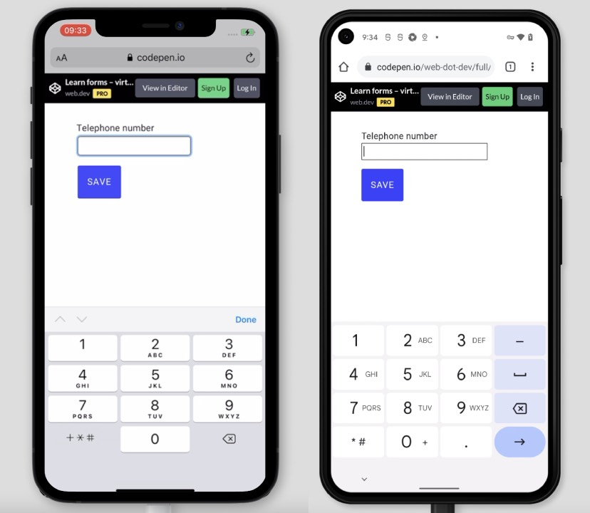

# Тестирование форм на различных устройствах

<big>Убедитесь, что ваша форма работает на различных устройствах, в браузерах, на платформах и в различных контекстах.</big>

Форму можно заполнить разными способами. Люди могут заполнять форму на смартфоне, стоя в переполненном автобусе, или с помощью устройства чтения с экрана, или со старого ноутбука. Давайте посмотрим, как обеспечить работу формы на разных устройствах и в разных контекстах.

## Убедитесь, что ваша форма работает для пользователей клавиатуры

Хорошим первым тестом для проверки доступности формы является ее заполнение с помощью клавиатуры. Откройте форму и попробуйте перейти по ней с помощью клавиши ++tab++. Понятно ли, какое поле формы активно в данный момент? Чтобы помочь пользователям понять, какое поле формы активно, можно использовать индикаторы фокуса.

<iframe src="https://codepen.io/web-dot-dev/embed/be0759d9436d84426a795a9ae399eff9?height=300&amp;theme-id=light&amp;default-tab=result&amp;editable=true" style="height: 300px; width: 100%; border: 0;" loading="lazy"></iframe>

[Попробуйте самостоятельно](https://codepen.io/web-dot-dev/pen/be0759d9436d84426a795a9ae399eff9). Используйте клавишу `tab` для перехода к вводу. Видите ли вы контур, когда вход активен? Это и есть индикатор фокуса. Добавить индикаторы фокуса можно с помощью CSS-псевдокласса [`:focus`](../../css/focus.md).

```css
input:focus {
    outline: 4px solid #222;
}
```

Подробнее о [разработке доступных целевых индикаторов](https://www.sarasoueidan.com/blog/focus-indicators/).

!!!note ""

    Если необходимо убрать стандартные стили `:focus`, но при этом отобразить индикаторы фокуса для пользователей клавиатуры, можно воспользоваться CSS-псевдоклассом `:focus-visible`.

    Подробнее о [`:focus-visible`](https://web.dev/style-focus/#use-focus-visible-to-selectively-show-a-focus-indicator).

## Помогите пользователям ориентироваться в вашей форме.

Еще одним хорошим тестом на удобство использования и доступность является проверка того, что логический порядок вкладок соответствует визуальному порядку вкладок. Как можно проверить порядок вкладок? Полностью перейдите по вкладкам вашей формы. Заметили ли вы какие-либо нелогичные навигационные переходы? Убедитесь, что порядок в DOM соответствует визуальному порядку.

Подробнее о том, как [обеспечить соответствие визуального порядка на странице порядку DOM](https://web.dev/visual-order-follows-dom/).

## Помогите пользователям заполнить форму на сенсорных устройствах.

Отлично! Вы убедились, что ваша форма работает с клавиатурой. Теперь давайте посмотрим, как сделать так, чтобы она работала и на сенсорных устройствах, например на мобильных телефонах.

Откройте форму на сенсорном устройстве, заполните все поля и отправьте форму. Приходилось ли вам несколько раз нажимать кнопку мыши, чтобы выбрать элемент управления формы? Возможно, проблема заключается в том, что области отвода слишком малы. Убедитесь, что [размер кнопки](https://web.dev/accessible-tap-targets/) составляет не менее 48px, и что каждый элемент `<input>` и `<select>` достаточно велик для касания. Вы также можете помочь пользователям ориентироваться в форме на сенсорных устройствах, добавив достаточное расстояние между элементами управления формы.

## Обеспечьте пользователям оптимизированную клавиатуру

В предыдущих модулях вы узнали, как активировать различные виды экранной клавиатуры с помощью атрибутов `type` или `inputmode`.

<iframe src="https://codepen.io/web-dot-dev/embed/88f1ffed62ef6bdd513351823b7aaa0f?height=300&amp;theme-id=light&amp;default-tab=html%2Cresult&amp;editable=true" style="height: 300px; width: 100%; border: 0;" loading="lazy"></iframe>

Откройте [демонстрационную версию](https://codepen.io/web-dot-dev/pen/88f1ffed62ef6bdd513351823b7aaa0f) на телефоне и нажмите в поле телефонного номера. Обратите внимание, что по умолчанию на экранной клавиатуре отображаются цифры, а также другие символы, которые могут понадобиться для ввода телефонного номера. Используйте `type="tel"`, чтобы получить экранную клавиатуру, оптимизированную для ввода телефонных номеров.



Воспользуйтесь телефоном, чтобы [опробовать его на практике](https://codepen.io/web-dot-dev/pen/88f1ffed62ef6bdd513351823b7aaa0f), и посмотрите, сможете ли вы легко ввести все символы, необходимые для заполнения телефонного номера. Если вам интересно, как работает экранная клавиатура для другого `type`, попробуйте `type="email"` в [демонстрации](https://codepen.io/web-dot-dev/pen/88f1ffed62ef6bdd513351823b7aaa0f).

## Убедитесь, что кнопки формы не скрыты

Представьте себе, что вы заполнили длинную форму и готовы ее отправить. Но где находится кнопка **Submit**? Возможно, она находится за панелью инструментов браузера, расположенной в нижней части экрана. Одним из способов обеспечить видимость кнопок является использование функции [`env()`](<https://developer.mozilla.org/docs/Web/CSS/env()>). Узнайте, как [обеспечить, чтобы кнопки не заслонялись пользовательскими интерфейсами устройств](<https://developer.mozilla.org/docs/Web/CSS/env()#using_env_to_ensure_buttons_are_not_obscured_by_device_ui>).

## Убедитесь, что ваша форма работает на разных платформах

Постарайтесь протестировать свои формы на как можно большем количестве устройств. У вас есть старый ноутбук? Откройте на нем браузер по умолчанию и протестируйте свою форму. У вашего друга есть планшет? Одолжите его и протестируйте форму на нем.

Некоторые стили выглядят по-разному в одном браузере? О том, как обеспечить работу [стилей на разных платформах](styling.md), читайте в одном из следующих модулей.

[BrowserStack](https://www.browserstack.com) предлагает бесплатные тестовые аккаунты для проектов с открытым исходным кодом, а [Browserling](https://www.browserling.com) - бесплатную пробную версию для тестирования на различных браузерах, устройствах и операционных системах.

## Помогайте пользователям заполнять формы в различных контекстах

Люди используют не только различные браузеры, устройства и операционные системы. Люди также используют ваши формы в разных контекстах. Попробуйте! На улице сейчас светит солнце? Возьмите свой телефон и выйдите на улицу. Использование формы при ярком свете - хороший способ проверить, насколько удобны коэффициенты контрастности.

Узнайте больше о [доступности цвета и контраста](https://web.dev/color-and-contrast-accessibility/).

## Обеспечьте работу формы при плохом соединении

Допустим, вы едете куда-то в поезде. Вы открываете веб-страницу на своем телефоне. Вы удивляетесь, как загрузка сайта может занимать столько времени 😕.

Вы можете имитировать медленные соединения и различные типы сетей с помощью [WebPageTest](https://webpagetest.org/easy) или [DevTools](https://developer.chrome.com/docs/devtools/device-mode/#network).

Подробнее о [тестировании с низкой пропускной способностью и высокой задержкой](https://web.dev/performance-poor-connectivity/#testing).

## Помогите пользователям использовать вашу форму на ходу

Представьте, что вы идете на встречу. Вдруг у вас звонит телефон, вы отвечаете на звонок и одновременно получаете уведомление от страховой компании о необходимости заполнить начатую форму заявления. Вы открываете бланк и пытаетесь заполнить его, не переставая при этом ходить и разговаривать.

Помните, что люди будут использовать ваши формы в различных ситуациях. В стрессовых ситуациях, при выполнении других дел, на ходу. Вы можете помочь пользователям, обеспечив простоту использования формы.

Попробуйте установить для себя лимит времени на заполнение формы. Попробуйте смоделировать несовершенные условия, в которых вы сможете протестировать свою форму.

## Обязательно делитесь результатами тестирования

Документируйте все тесты и делитесь результатами с командой. Это поможет определить приоритетность действий, чтобы все члены команды были в курсе наиболее важных задач.

Подробнее о [совместном использовании результатов тестирования](https://web.dev/performance-audit-share/).

## Ресурсы

-   [WebPageTest](https://webpagetest.org/easy): Тесты производительности и оптимизации веб-сайтов
-   [Тестирование при низкой пропускной способности и высокой задержке](https://web.dev/performance-poor-connectivity/#testing)
-   [Обмен результатами тестирования](https://web.dev/performance-audit-share/)

:material-information-outline: Источник &mdash; [Test forms across devices and platforms](https://web.dev/learn/forms/cross-platform-testing/)
