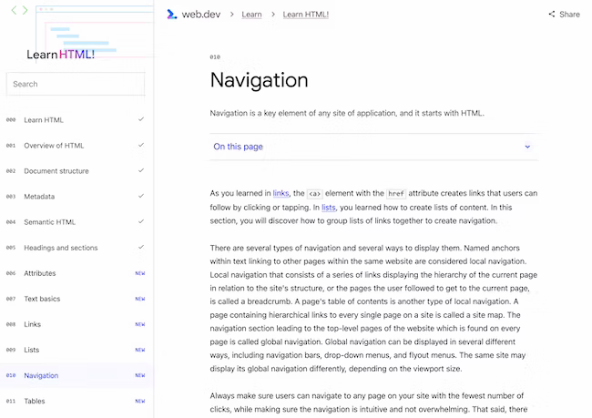
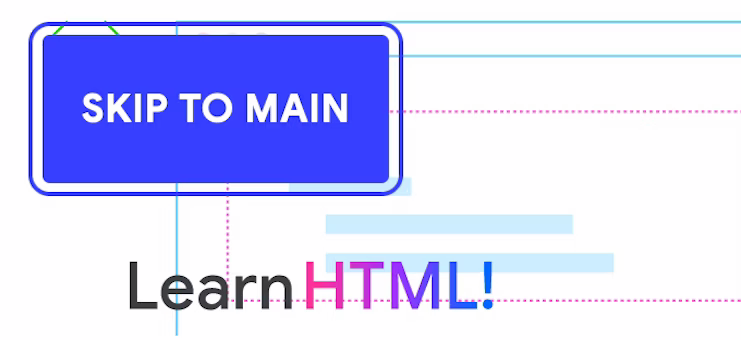
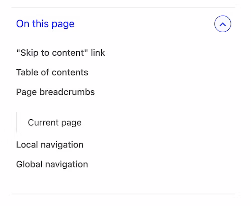
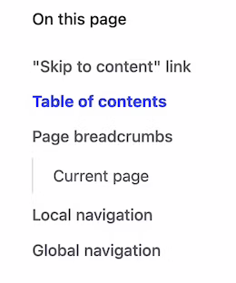
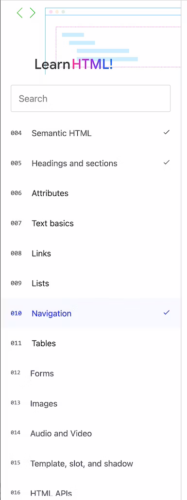

# Навигация

<big>Навигация — ключевой элемент любого сайта или приложения, и начинается она с HTML.</big>

Как вы узнали в разделе "[ссылки](links.md)", элемент [`<a>`](../../html/a.md) с атрибутом [`href`](../../html/a.md#href) создает ссылки, по которым пользователи могут переходить, щелкая или касаясь их. В разделе о [списках](lists.md) вы узнали, как создавать списки содержимого. В этом разделе вы узнаете, как группировать списки ссылок для создания навигации.

Существует несколько типов навигации и несколько способов их отображения. Именованные якоря в тексте, ссылающиеся на другие страницы в пределах одного сайта, считаются локальной навигацией. Локальная навигация, состоящая из ряда ссылок, отображающих иерархию текущей страницы по отношению к структуре сайта, или страницы, по которым пользователь перешел, чтобы попасть на текущую страницу, называется хлебной крошкой.

Оглавление страницы — это еще один вид локальной навигации. Страница, содержащая иерархические ссылки на все страницы сайта, называется картой сайта. Раздел навигации, ведущий к страницам верхнего уровня сайта и присутствующий на каждой странице, называется глобальной навигацией. Глобальная навигация может быть представлена несколькими способами, включая навигационные панели, выпадающие и раскрывающиеся меню. На одном и том же сайте глобальная навигация может отображаться по-разному, в зависимости от размера области просмотра.

Всегда следите за тем, чтобы пользователи могли перейти на любую страницу вашего сайта с помощью минимального количества щелчков мыши, а сама навигация была интуитивно понятной и не перегруженной. При этом особых требований к навигационным элементам не существует. [MachineLearningWorkshop.com](https://machinelearningworkshop.com), будучи одностраничным сайтом, имеет локальную навигационную панель в правом верхнем углу; на многостраничных сайтах именно здесь часто размещается глобальная навигация.



Если вы просматриваете эту страницу на web.dev, то можете заметить несколько особенностей навигации. Над заголовком находится хлебная крошка, после заголовка — оглавление "На этой странице", а также оглавление "Изучение HTML", которое в зависимости от ширины экрана либо отображается всегда, либо становится видимым при нажатии на кнопку меню. Первым элементом на странице является скрытая ссылка на `#main`, которая позволяет пропустить как боковую панель, так и ссылки на хлебные крошки.

## Ссылка "Перейти к содержимому" {#skip-to-content-link}

Первый элемент на странице является внутренней ссылкой:

```html
<a href="#main" class="skip-link button">Skip to main</a>
```

который при нажатии на него или при наличии фокуса и нажатии пользователем кнопки ++enter++ прокручивает страницу и передает фокус основному содержимому: ориентиру [`<main>`](../../html/main.md) с `id` `main`:

```html
<main id="main"></main>
```

Возможно, вы никогда не видели эту ссылку на сайте, даже если прочитали все предыдущие разделы. Она отображается только при наличии фокуса:



Для повышения удобства использования и доступности важно дать пользователям возможность обходить блоки контента, которые повторяются на каждой странице. Ссылка на пропуск включается для того, чтобы пользователь, нажимающий при загрузке клавишу ++tab++, мог быстро перейти к основному содержанию сайта, избежав необходимости переходить по обширным ссылкам. На этой странице ссылка "пропустить" пропускает навигацию по боковым панелям разделов и хлебные крошки, переводя пользователя непосредственно к заголовку страницы.

Большинству дизайнеров не нравится, когда ссылка располагается в верхней части страницы. Можно скрыть ссылку от посторонних глаз, помня при этом, что когда ссылка окажется в фокусе, а это произойдет, когда пользователь клавиатуры перейдет по ссылке на страницу, ссылка должна быть видна всем пользователям. Скрывать содержимое в нефокусном и неактивном состоянии можно только с помощью селектора, аналогичного `.visually-hidden:not(:focus):not(:active)`.

Текст ссылки гласит "перейти к основному". Это доступное имя ссылки. Это технический сайт, и пользователи, вероятно, знают, что означает слово "главная". Как и весь текст ссылки, доступное имя должно четко указывать, куда ведет ссылка. Целью ссылки должно быть начало основного содержания страницы. Чтобы проверить это, при загрузке страницы перейдите по вкладке к ссылке "Skip to main". Затем нажмите ++enter++, чтобы убедиться, что ссылка "переходит" к основному содержанию.

## Оглавление

Ссылка skip-to-content прокручивает основное содержание. Первым элементом является заголовок [`<h1>`](../../html/h1.md) с названием данного раздела. В данном случае `<h1>Разметка навигации</h1>`. За основным заголовком следует теглайн — краткое описание содержания данного учебника. Будет ли навигация по оглавлению идти до или после заголовка в кодовой базе, зависит от ширины вашего браузера.

<figure markdown>

<figcaption>На узких экранах оглавление скрывается за кнопкой "На этой странице", которая переключает видимость навигации.</figcaption>
</figure>

<figure markdown>

<figcaption>На широких экранах оглавление всегда видно, а ссылка на текущий раздел выделена синим цветом.</figcaption>
</figure>

Если ширина браузера превышает `80em`, то оглавление в разметке располагается перед заголовком и выглядит следующим образом (имена классов удалены для упрощения разметки):

```html
<nav aria-label="On this page">
    <div>On this page</div>
    <div>
        <ul>
            <li>
                <a href="#skip">Skip to content link</a>
            </li>
            <li>
                <a href="#toc">Table of contents</a>
            </li>
            <li>
                <a href="#bc">Page breadcrumbs</a>
            </li>
            <li>
                <a href="#ln">Local navigation</a>
            </li>
            <li>
                <a href="#global">Global navigation</a>
            </li>
        </ul>
    </div>
</nav>
```

Элемент `<nav>` лучше всего использовать для разделов навигации: он автоматически сообщает программе чтения с экрана и поисковой системе, что раздел имеет роль `navigation`, роль ориентира.

Включение атрибута [`aria-label`](https://developer.mozilla.org/docs/Web/Accessibility/ARIA/Attributes/aria-label) дает краткое описание назначения навигации. В данном случае, поскольку значение атрибута является избыточным для текста, видимого на странице, предпочтительнее использовать [`aria-labelledby`](https://developer.mozilla.org/docs/Web/Accessibility/ARIA/Attributes/aria-labelledby) для ссылки на видимый текст.

Мы можем изменить несемантический [`<div>`](../../html/div.md) на абзац [`<p>`](../../html/p.md), затем добавить [`id`](attributes.md#id), чтобы на него можно было ссылаться. Затем мы используем `aria-labelledby`:

```html
<nav aria-labelledby="tocTitle">
    <p id="tocTitle">On this page</p>
</nav>
```

Помимо сокращения избыточности, видимый текст переводится службами перевода, в то время как значения атрибутов могут и не переводиться. По возможности, если имеется текст, обеспечивающий адекватную метку, отдавайте предпочтение ему, а не тексту атрибута.

Эта навигация является оглавлением. Если вы хотите использовать `aria-label`, предоставьте эту информацию, а не повторяйте видимый текст:

```html
<nav aria-label="Table of Contents">
    <p>On this page</p>
</nav>
```

При указании доступного имени элемента не следует указывать его название. Эту информацию предоставляют пользователю программы чтения с экрана. Например, при использовании элемента [`<nav>`](../../html/nav.md) не следует включать слово "навигация"; эта информация включается при использовании семантических элементов.

Сами ссылки располагаются в виде неупорядоченного списка. Хотя они не обязательно должны быть вложены в список, использование списка позволяет пользователям программы чтения с экрана знать, сколько элементов списка, а значит, и ссылок, приходится на отдельный список в навигации.

```html
<nav aria-labelledby="tocTitle">
    <p id="tocTitle">On this page</p>
    <ul role="list">
        <li>
            <a href="#skip">Skip to content link</a>
        </li>
        <li>
            <a href="#toc">Table of contents</a>
        </li>
        <li>
            <a href="#bc">Page breadcrumbs</a>
        </li>
        <li>
            <a href="#ln">Local navigation</a>
        </li>
        <li>
            <a href="#global">Global navigation</a>
        </li>
    </ul>
</nav>
```

Если ширина браузера не превышает `80em`, то виджет "На этой странице" располагается ниже заголовка и теглайна. Это достигается за счет включения двух навигационных компонентов таблицы содержания и скрытия одного или другого с помощью CSS `display: none;` на основе медиазапроса.

Включение двух одинаковых виджетов для отображения только одного из них является антипаттерном. Дополнительные байты незначительны. Скрытие HTML-содержимого от всех пользователей с помощью CSS `display: none` вполне уместно. Проблема заключается в том, что на широких экранах оглавление располагается перед `#main`, а на узких экранах оглавление вложено в `#main`. При использовании клавиатуры для перехода к содержимому на широком экране оглавление пропускается. Хотя пользователи привыкли к тому, что контент реагирует на изменения и меняет свое местоположение при смене устройства или увеличении размера шрифта, они не ожидают, что порядок вкладок при этом изменится. Макеты страниц должны быть доступными, предсказуемыми и последовательными на всем сайте. В данном случае расположение оглавления не является предсказуемым.

## Хлебные крошки страницы

Хлебные крошки обеспечивают вторичную навигацию, помогая пользователям понять, где они находятся на сайте. Обычно они показывают иерархию URL текущего документа и местоположение текущей страницы в структуре сайта. Структура сайта с точки зрения пользователя может отличаться от файловой структуры на сервере. Это нормально. Пользователю не обязательно знать, как организованы ваши файлы, но он должен уметь ориентироваться в вашем содержимом.

Хлебные крошки помогают пользователям ориентироваться и понимать организацию сайта, позволяя им быстро переходить к любым разделам-предшественникам без необходимости возвращаться на каждую предыдущую страницу, чтобы попасть на текущую, используя функцию `back`.

Если сайт имеет простую иерархическую структуру каталогов, как это имеет место в web.dev, то навигация по хлебным крошкам часто состоит из ссылки на home, или имя хоста, со ссылкой на индексный файл каждого каталога в имени пути URL. Включение текущей страницы является необязательным и требует некоторого дополнительного внимания.

```js
const url = new URL(
    'https://web.dev/learn/html/navigation'
);
const sections = url.hostname + url.pathname.split('/');
// "web.dev,learn,html,navigation"
```

Секции хлебной крошки показывают путь от текущей страницы обратно к главной странице, отображая каждый уровень между ними.


Каждая страница модуля Learn HTML имеет одинаковую навигационную хлебную крошку, отображающую иерархию уроков `HTML` в секции `learn` раздела `web.dev`. Код аналогичен приведенному ниже, но для наглядности удалены классы и детали SVG:

```html
<nav aria-label="breadcrumbs">
    <ul role="list">
        <li>
            <a href="/">
                <svg aria-label="web.dev" role="img">
                    <use href="#webDevLogo" />
                </svg>
            </a>
        </li>
        <li>
            <a href="/learn/">Learn</a>
        </li>
        <li>
            <a href="/learn/html">Learn HTML!</a>
        </li>
    </ul>
    <share-action
        authors="@estellevw"
        data-action="click"
        data-category="web.dev"
        data-icon="share"
        data-label="share, twitter"
        role="button"
        tabindex="0"
    >
        <svg aria-label="share" role="img">
            <use href="#shareIcon" />
        </svg>
        <span>Share</span>
    </share-action>
</nav>
```

Эта хлебная крошка соответствует лучшим практикам. В ней используется элемент [`<nav>`](../../html/nav.md), играющий роль ориентира, поэтому вспомогательные технологии представляют хлебные крошки как навигационный элемент на странице. Доступное имя "хлебные крошки", снабженное меткой `aria-label`, отличает их от других навигационных ориентиров в текущем документе.

Между ссылками располагаются CSS-генерируемые разделители содержимого. Разделители располагаются перед каждым элементом списка, начиная со второго [`<li>`](../../html/li.md).

```css
[aria-label^='breadcrumb' i] li + li::before {
    content: '';
    display: block;
    width: 8px;
    height: 8px;
    border-top: 2px solid currentColor;
    border-right: 2px solid currentColor;
    rotate: 45deg;
    opacity: 0.8;
}
```

Программы чтения с экрана не будут их "видеть", что является наилучшей практикой: разделители между ссылками хлебных крошек должны быть скрыты от программ чтения с экрана. Кроме того, они должны быть достаточно контрастными по отношению к фону, как и обычный текст.

В данной версии используется неупорядоченный список и элементы списка. Упорядоченный список предпочтительнее, так как элементы упорядоченного списка перечисляются. Кроме того, это список: `role="list"` было добавлено, поскольку некоторые значения свойства отображения CSS лишают семантики некоторые элементы.

Вообще, ссылка на главную страницу в хлебной крошке должна иметь значение "home", а не быть логотипом сайта с названием сайта в качестве метки. Но поскольку хлебная крошка находится в верхней части документа и является единственным появлением логотипа на странице, то становится понятно, почему был использован этот антипаттерн.

Последний элемент — это пользовательский элемент `<share-action>`. Пользовательские элементы рассматриваются далее. Хотя этот пользовательский элемент не является частью хлебной крошки, включение несвязанного элемента в `<nav>` вполне допустимо, если это включение единообразно на всех страницах.

### Текущая страница

На этой странице текущая страница "Навигация" не включена в хлебную крошку. Когда текущая страница включается в хлебную крошку, текст предпочтительно не должен быть ссылкой, а `aria-current="page"` должен быть включен в элемент списка текущей страницы. В тех случаях, когда он не включен, полезно указать на то, что следующий за ним заголовок является текущей страницей, с помощью пиктограммы или другого символа.

При изменении дизайна можно использовать альтернативный вариант хлебной крошки:

```html
<nav aria-label="breadcrumbs">
    <ol role="list">
        <li>
            <a href="/">Home</a>
        </li>
        <li>
            <a href="/learn/">Learn</a>
        </li>
        <li>
            <a href="/learn/html">Learn HTML!</a>
        </li>
        <li aria-current="page">Navigation</li>
    </ol>
</nav>
```

Хлебные крошки не предназначены для линейных шагов. Например, список путей, по которым пользователь перешел на текущую страницу, или список шагов, пройденных до этого момента в рецепте, может быть вложен в `<nav>`, но не должен обозначаться как хлебная крошка.

## Локальная навигация {#local-navigation}

На этой странице есть еще один навигационный компонент. Если вы находитесь на широком экране, то слева расположена боковая панель с логотипом "Learn HTML", строкой поиска и ссылками на каждый из 20 разделов "Learn HTML". Каждая ссылка содержит номер главы, название раздела и галочку справа от разделов, которые вы уже посещали — возможно, этот раздел, если вы переходили от него и вернулись. Ссылки на все разделы в Learn HTML, а также на поиск и локальный заголовок являются навигацией по сайту.

Если вы посещаете этот сайт на планшетном или мобильном устройстве или имеете более узкий экран, то при загрузке этой страницы боковая панель будет скрыта. Сделать ее видимой можно с помощью гамбургер-меню в верхней панели навигации (да, заголовок — это пользовательский элемент `<web-header>` с установленной `ролью="navigation"`).

Основное отличие постоянной локальной навигации на широких экранах от локальной навигации на более узких экранах, которую можно сделать появляющейся и исчезающей, заключается в отображении кнопки закрытия на версии, которую можно скрыть. На широких экранах этот значок скрывается с помощью `display: none;`.



Ссылка на данный документ, раздел 010, имеет несколько иной вид, чем другие ссылки в локальной навигации, чтобы указать зрячим пользователям, что это текущая страница. Это визуальное отличие создается с помощью CSS. Текущая страница также идентифицируется с помощью атрибута `aria-current="page"`. Это информирует вспомогательные технологии о том, что это ссылка на текущую страницу. HTML для этого элемента списка в рамках локальной навигации выглядит следующим образом:

```html
<li>
    <a
        aria-current="page"
        href="/learn/html/navigation/"
        data-complete="true"
    >
        <span>010</span>
        <span>Navigation</span>
        <svg aria-label="Check" role="img">
            <use href="#checkmark" />
        </svg>
    </a>
</li>
```

Если вы посещаете эту страницу не в первый раз, то галочка не будет видна. Если вы посещали эту страницу в прошлом, то для `data-complete` [пользовательского атрибута](attributes.md) установлено значение `true`, и флажок будет отображаться. Флажок включен в каждую ссылку, но CSS скрывает его от пользователей, не посещавших эту страницу ранее, с помощью `display: none`, основываясь на отсутствии атрибута `data-complete="true"` и его значения:

```css
.course .stack-nav a:not([data-complete='true']) svg {
    display: none;
}
```

Когда `display` имеет значение, отличное от `none`, `role` сообщает вспомогательным технологиям, что инлайн SVG является изображением, а `aria-label` действует как атрибут `alt` в ``.

## Глобальная навигация

Глобальная навигация — это раздел навигации, ведущий к страницам верхнего уровня сайта, который одинаков на всех страницах сайта. Глобальная навигация сайта может также состоять из вкладок, открывающих вложенные списки ссылок на все подразделы сайта, или других меню. Она может включать в себя заголовки разделов, кнопки и виджеты поиска. Эти дополнительные возможности не являются обязательным условием. Требуется, чтобы навигация отображалась на каждой странице и была одинаковой на всех страницах; разумеется, с указанием `aria-current="page"` для всех ссылок на текущую страницу.

Глобальная навигация обеспечивает последовательное перемещение в любой точке приложения или сайта. У Google нет глобальной навигации в верхней части страницы. У Yahoo! она есть. Хотя все основные свойства Yahoo! имеют различные стили, содержание большинства разделов одинаково.


---


Содержание заголовков глобальной навигации в разделах "Новости" и "Спорт" одинаково, но пиктограмма, показывающая, что пользователь находится в разделе "Спорт", недостаточно контрастна, чтобы быть доступной даже для посетителей, не имеющих слабого зрения. В обоих разделах имеется глобальная навигация, под которой располагается локальная навигация по конкретным разделам.

Как и глобальная навигация, нижние колонтитулы должны быть одинаковыми на всех страницах. Но это единственное сходство. Глобальная навигация позволяет ориентироваться во всех разделах сайта с точки зрения продукта. К элементам навигации в нижнем колонтитуле не предъявляется особых требований. Как правило, нижний колонтитул содержит корпоративные ссылки, такие как юридическая информация, информация о компании, карьера, и может вести на внешние источники, например, на значки социальных сетей.

Нижний колонтитул этой страницы содержит три дополнительных элемента `<nav>`: навигация по нижнему колонтитулу, разработчики Google и условия и политика, причем каждый из них является ссылкой. Навигация в нижнем колонтитуле включает в себя информацию о том, как внести вклад в web.dev на Github, другие образовательные материалы, предоставляемые Google за пределами web.dev, и внешние ссылки "как подключиться".

Эти три навигации в [`<footer>`](../../html/footer.md) являются элементами `<nav>` с меткой `aria-label`, предоставляющей доступное имя для этих знаковых ролей. Все рассмотренные нами навигации представляют собой [ссылки](links.md), вложенные в [списки](lists.md) внутри навигации. Мы рассмотрели все, что необходимо знать для создания собственных навигаций. Далее мы рассмотрим разметку таблиц данных.

## Источники

-   [Navigation](https://web.dev/learn/html/navigation/)
