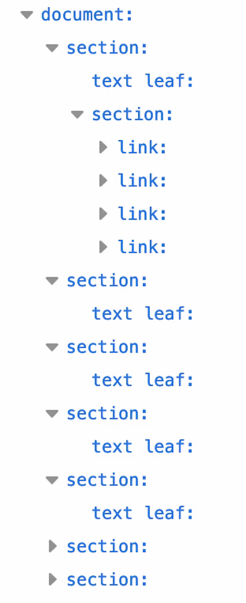
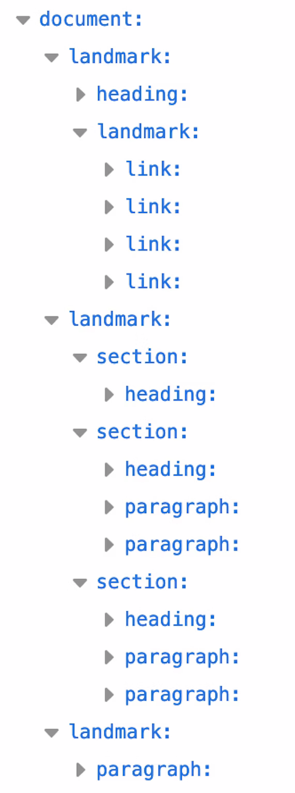
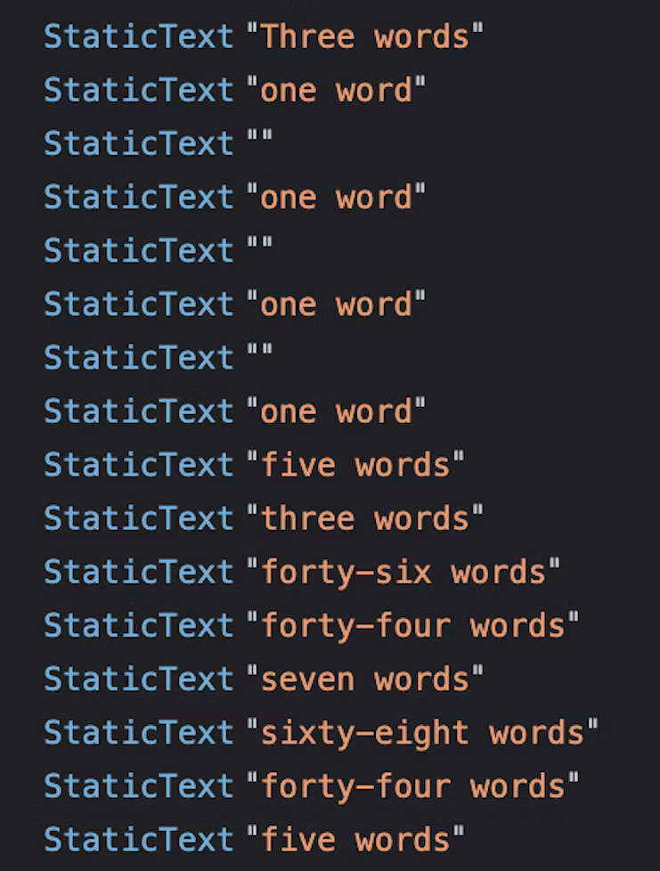
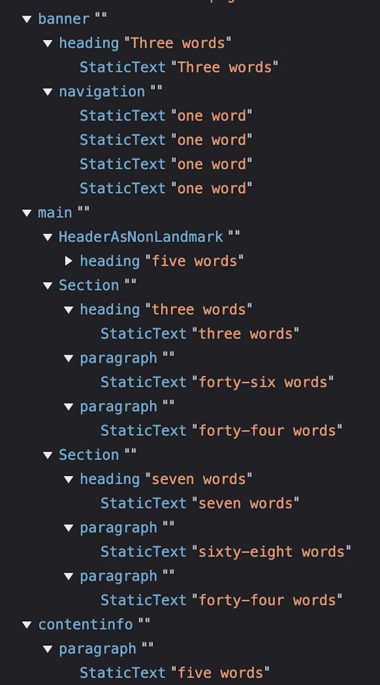

# Семантический HTML

<big>Использование правильных элементов HTML для описания содержимого документа.</big>

Имея более 100 элементов HTML и возможность создавать собственные элементы, можно бесконечно долго размечать содержимое, но некоторые способы — в частности, _семантический_ — лучше других.

_Семантический_ означает "относящийся к смыслу". Написание семантического HTML означает использование элементов HTML для структурирования содержимого на основе смысла каждого элемента, а не его внешнего вида.

В этой серии статей мы рассмотрели еще не так много элементов HTML, но даже без знания HTML следующие два фрагмента кода показывают, как семантическая разметка может придать содержимому контекст. В обоих случаях вместо _ipsum lorem_ используется подсчет слов для экономии прокрутки — используйте свое воображение, чтобы превратить "тридцать слов" в 30 слов:

В первом фрагменте кода используются `<div>` и `<span>`, два элемента, не имеющие семантического значения.

```html
<div>
    <span>Three words</span>
    <div>
        <a>one word</a>
        <a>one word</a>
        <a>one word</a>
        <a>one word</a>
    </div>
</div>
<div>
    <div>
        <div>five words</div>
    </div>
    <div>
        <div>three words</div>
        <div>forty-six words</div>
        <div>forty-four words</div>
    </div>
    <div>
        <div>seven words</div>
        <div>sixty-eight words</div>
        <div>forty-four words</div>
    </div>
</div>
<div>
    <span>five words</span>
</div>
```

Понимаете ли вы, к чему относятся эти слова? Не совсем.

Давайте перепишем этот код с использованием семантических элементов:

```html
<header>
    <h1>Three words</h1>
    <nav>
        <a>one word</a>
        <a>one word</a>
        <a>one word</a>
        <a>one word</a>
    </nav>
</header>
<main>
    <header>
        <h1>five words</h1>
    </header>
    <section>
        <h2>three words</h2>
        <p>forty-six words</p>
        <p>forty-four words</p>
    </section>
    <section>
        <h2>seven words</h2>
        <p>sixty-eight words</p>
        <p>forty-four words</p>
    </section>
</main>
<footer>
    <p>five words</p>
</footer>
```

Какой блок кода передает смысл? Используя только несемантические элементы `<div>` и `<span>`, невозможно определить, что представляет собой содержимое первого блока кода. Второй пример кода с семантическими элементами содержит достаточно контекста для того, чтобы не-кодер мог расшифровать назначение и смысл, даже не сталкиваясь с HTML-тегами. Определенно достаточно контекста для того, чтобы разработчик мог понять суть страницы, даже если он не понимает ее содержимого, например, содержимого на иностранном языке.

Во втором блоке кода мы можем понять архитектуру даже без понимания содержимого, поскольку семантические элементы обеспечивают смысл и структуру. Можно сказать, что первый заголовок — это баннер сайта, причем `<h1>`, скорее всего, является названием сайта. Нижний колонтитул — это нижний колонтитул сайта: пять слов могут быть заявлением об авторских правах или адресом компании.

Семантическая разметка — это не только облегчение чтения разметки для разработчиков, но и облегчение расшифровки разметки для автоматизированных средств. Инструменты разработчика демонстрируют, как семантические элементы обеспечивают также и машиночитаемую структуру.

## Объектная модель доступности (AOM)

По мере разбора полученного содержимого браузер строит объектную модель документа (DOM) и объектную модель CSS (CSSOM). Затем он также строит дерево доступности. Вспомогательные устройства, такие как программы чтения с экрана, используют AOM для анализа и интерпретации содержимого. DOM — это дерево всех узлов документа. AOM — это как бы семантическая версия DOM.

Давайте сравним, как обе эти структуры документов отображаются в панели доступности Firefox:

=== "Несемантическая разметка"

    Первый фрагмент кода. Список узлов, все из которых являются ссылками или текстовыми литералами.

    

=== "Семантическая разметка"

    Второй фрагмент кода. Список узлов с четкими обозначениями.

    

На втором снимке экрана во втором блоке кода присутствуют четыре роли ориентиров. В нем используются семантические ориентиры, удобно названные [`<header>`](../../html/header.md), [`<main>`](../../html/main.md), [`<footer>`](../../html/footer.md) и [`<nav>`](../../html/nav.md) для "навигации". Эти ориентиры придают веб-контенту структуру и обеспечивают удобную клавиатурную навигацию по важным разделам контента для пользователей программ чтения с экрана.

Обратите внимание, что `<header>` и `<footer>` являются ориентирами с ролями `banner` и `contentinfo` соответственно, когда они не вложены в другие ориентиры. В AOM Chrome это показано следующим образом:

=== "Несемантическая разметка"

    Первый фрагмент кода. Все текстовые узлы отображаются как статический текст.

    

=== "Семантическая разметка"

    Второй фрагмент кода. Все текстовые узлы имеют описания.

    

Если посмотреть на инструменты разработчика Chrome, то можно заметить существенную разницу между объектной моделью доступности при использовании семантических элементов и без них.

Совершенно очевидно, что использование семантических элементов способствует доступности, а использование несемантических элементов снижает ее. HTML, как правило, по умолчанию является доступным. Наша задача как разработчиков заключается как в защите доступности HTML по умолчанию, так и в обеспечении максимальной доступности. Вы можете [проверить AOM в инструментах разработчика](https://developer.chrome.com/docs/devtools/accessibility/reference/#explore-tree).

### Атрибут `role` {#the-role-attribute}

Атрибут `role` описывает роль элемента в контексте документа. Атрибут `role` является глобальным атрибутом, т.е. он действителен для всех элементов, определяемых [спецификацией ARIA](https://w3c.github.io/aria/#dfn-role), а не [спецификацией WHATWG HTML](https://html.spec.whatwg.org/dev/), где определено практически все остальное в этой серии.

Семантические элементы имеют неявную роль, которая зависит от контекста. Как мы видели на скриншоте инструментов разработчика доступности Firefox, элементы верхнего уровня `<header>`, `<main>`, `<footer>` и `<nav>` являются ориентирами, а `<header>`, вложенный в `<main>`, — разделом. На скриншоте Chrome эти элементы перечислены [ARIA roles](https://developer.mozilla.org/docs/Web/Accessibility/ARIA/Roles): `<main>` — это `main`, `<nav>` — это `navigation`, а `<footer>`, поскольку он являлся нижним колонтитулом документа, — это `contentinfo`. Когда `<header>` является заголовком документа, роль по умолчанию — `banner`, что определяет раздел как глобальный заголовок сайта. Когда `<header>` или `<footer>` вложены в элемент секционирования, они не являются ролью `landmark`. Это видно на скриншотах обоих инструментов разработки.

Имена ролей элементов важны при построении АОМ. Семантика элемента, или "роль", важна для вспомогательных технологий и, в некоторых случаях, для поисковых систем. Пользователи вспомогательных технологий полагаются на семантику, чтобы ориентироваться в содержимом и понимать его смысл. Роль элемента позволяет пользователю быстро получить доступ к искомому контенту и, что, возможно, более важно, роль информирует пользователя программы чтения с экрана о том, как взаимодействовать с интерактивным элементом, когда он находится в фокусе внимания.

Интерактивные элементы, такие как кнопки, ссылки, диапазоны и флажки, имеют неявные роли, все они автоматически добавляются в последовательность клавиатурных вкладок и все они по умолчанию поддерживают ожидаемые действия пользователя. Неявная роль, или явное значение `role`, информирует пользователя о том, что он ожидает от элемента специфических пользовательских действий по умолчанию.

С помощью атрибута `role` можно присвоить любому элементу роль, в том числе и отличную от той, которую подразумевает тег. Например, `<button>` имеет неявную роль `button`. С помощью `role="button"` можно превратить любой элемент семантически в кнопку: `<p role="button">Click Me</p>`.

Хотя добавление к элементу `role="button"` информирует читателей экрана о том, что этот элемент является кнопкой, это не меняет ни внешнего вида, ни функциональности элемента. Элемент `button` предоставляет множество возможностей, не требуя от пользователя никакой работы. Элемент `button` автоматически добавляется в последовательность упорядочивания вкладок документа, то есть по умолчанию он является фокусом клавиатуры. Клавиши ++enter++ и ++space++ активизируют кнопку. Кнопки также имеют все методы и свойства, предоставляемые им интерфейсом [HTMLButtonElement](https://developer.mozilla.org/docs/Web/API/HTMLButtonElement). Если вы не используете семантическую кнопку для своей кнопки, то вам придется программировать все эти свойства заново. Гораздо проще просто использовать `<button>`.

Вернитесь к снимку экрана AOM для несемантического блока кода. Вы заметите, что у несемантических элементов нет неявных ролей. Мы можем сделать несемантическую версию семантической, назначив каждому элементу роль:

```html
<div role="banner">
    <span role="heading" aria-level="1">Three words</span>
    <div role="navigation">
        <a>one word</a>
        <a>one word</a>
        <a>one word</a>
        <a>one word</a>
    </div>
</div>
```

While the `role` attribute can be used to add semantics to any element, you should instead use elements with the implicit role you need.

## Семантические элементы

Если задать себе вопрос: "Какой элемент лучше всего отражает функцию этого раздела разметки?", то, как правило, выбирается лучший элемент для этой работы. Выбранный элемент, а следовательно, и используемые теги должны соответствовать отображаемому содержимому, поскольку теги имеют семантическое значение.

HTML должен использоваться для структурирования содержимого, а не для определения его внешнего вида. Внешний вид — это сфера CSS. Хотя для некоторых элементов определено определенное оформление, не следует использовать элемент, основываясь на том, как он выглядит по умолчанию в таблице стилей агента пользователя. Вместо этого выбирайте каждый элемент, исходя из его семантического значения и функциональности. Логическое, семантическое и смысловое кодирование HTML помогает обеспечить правильное применение CSS.

Выбор нужных элементов в процессе кодирования позволяет избежать необходимости рефакторинга или комментирования HTML. Если вы думаете о том, как использовать нужный элемент для работы, то чаще всего вы выбираете нужный элемент. Если нет, то, скорее всего, не выберете. Если вы понимаете семантику каждого элемента и осознаете, почему выбор правильного элемента важен, то, как правило, сможете сделать правильный выбор без особых дополнительных усилий.

В следующем разделе вы будете использовать семантические элементы для построения [структуры документа](document-structure.md).

## Источник

-   [Semantic HTML](https://web.dev/learn/html/semantic-html/)
