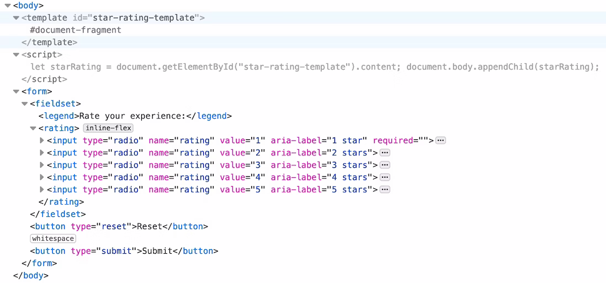
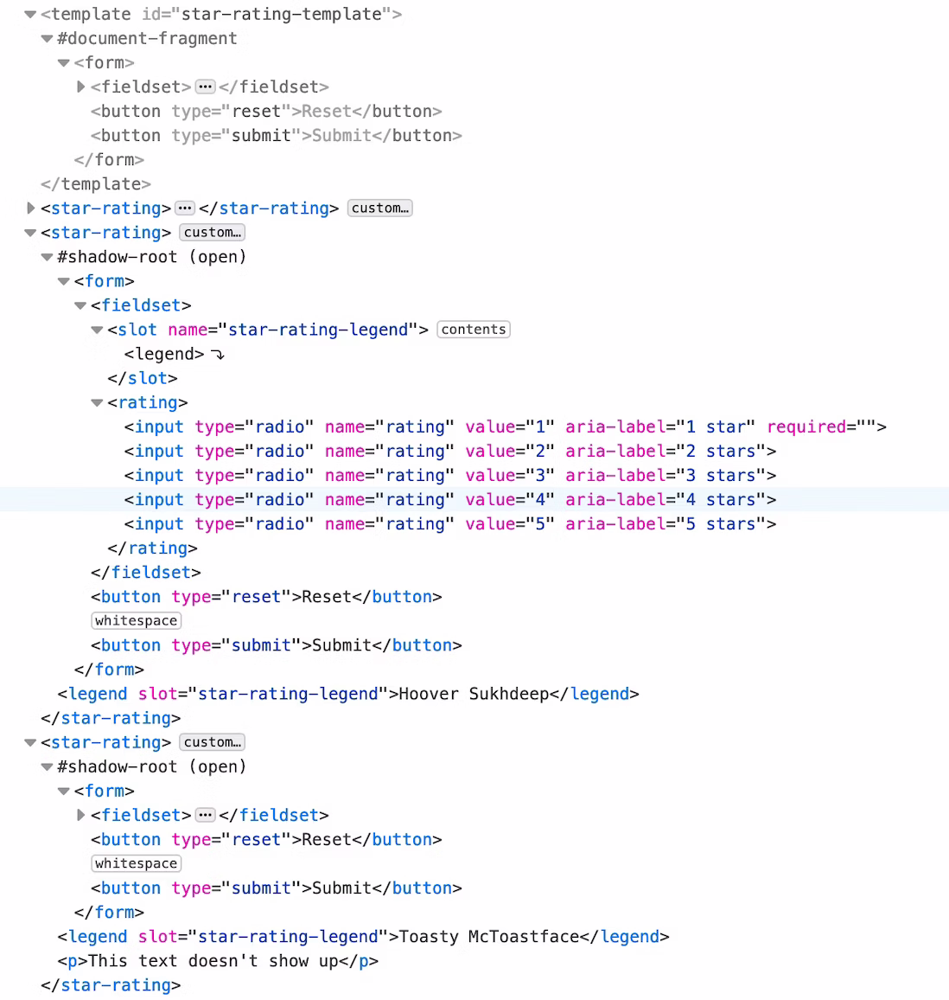

# Template, slot и shadow

<big>Объяснение понятий "шаблон", "слот" и "теневой DOM".</big>

Преимущество веб-компонентов заключается в возможности многократного использования: вы можете создать виджет пользовательского интерфейса один раз и использовать его многократно. Хотя для создания веб-компонентов необходим JavaScript, библиотека JavaScript не нужна. HTML и соответствующие API предоставляют все необходимое.

Стандарт Web Component состоит из трех частей - [HTML-шаблоны](https://developer.mozilla.org/docs/Web/Web_Components/Using_templates_and_slots), [Пользовательские элементы](https://developer.mozilla.org/docs/Web/Web_Components/Using_custom_elements) и [Теневой DOM](https://developer.mozilla.org/docs/Web/Web_Components/Using_shadow_DOM). В совокупности они позволяют создавать настраиваемые, самодостаточные (инкапсулированные), многократно используемые элементы, которые могут быть легко интегрированы в существующие приложения, как и все остальные элементы HTML, которые мы уже рассмотрели.

В этом разделе мы создадим элемент `<star-rating>` - веб-компонент, позволяющий пользователям оценивать свои впечатления по шкале от одной до пяти звезд. При присвоении имени пользовательскому элементу рекомендуется использовать все строчные буквы. Также следует включать тире, так как это помогает отличить обычные элементы от пользовательских.

Мы рассмотрим использование элементов `<шаблон>` и `<слот>`, атрибута `слот` и JavaScript для создания шаблона с инкапсулированным Shadow DOM. Затем мы будем повторно использовать определенный элемент, настраивая участок текста, как и любой другой элемент или веб-компонент. Мы также кратко обсудим использование CSS внутри и вне пользовательского элемента.

## Элемент `<template>`

Элемент [`<template>`](../../html/template.md) используется для объявления фрагментов HTML, которые будут клонироваться и вставляться в DOM с помощью JavaScript. По умолчанию содержимое элемента не выводится на экран. Скорее, оно инстанцируется с помощью JavaScript.

```html
<template id="star-rating-template">
    <form>
        <fieldset>
            <legend>Rate your experience:</legend>
            <rating>
                <input
                    type="radio"
                    name="rating"
                    value="1"
                    aria-label="1 star"
                    required
                />
                <input
                    type="radio"
                    name="rating"
                    value="2"
                    aria-label="2 stars"
                />
                <input
                    type="radio"
                    name="rating"
                    value="3"
                    aria-label="3 stars"
                />
                <input
                    type="radio"
                    name="rating"
                    value="4"
                    aria-label="4 stars"
                />
                <input
                    type="radio"
                    name="rating"
                    value="5"
                    aria-label="5 stars"
                />
            </rating>
        </fieldset>
        <button type="reset">Reset</button>
        <button type="submit">Submit</button>
    </form>
</template>
```

Поскольку содержимое элемента `<template>` не выводится на экран, то `<form>` и его содержимое не отображаются. Да, этот Codepen пуст, но если вы посмотрите на вкладку HTML, то увидите разметку `<template>`.

<iframe src="https://codepen.io/web-dot-dev/embed/vYzBNKR?height=500&amp;theme-id=light&amp;default-tab=result&amp;editable=true" style="height: 500px; width: 100%; border: 0;" loading="lazy"></iframe>

В данном примере `<form>` не является дочерним элементом `<template>` в DOM. Скорее, содержимое элементов `<template>` является дочерним элементом [`DocumentFragment`](https://developer.mozilla.org/docs/Web/API/DocumentFragment), возвращаемого свойством [`HTMLTemplateElement.content`](https://developer.mozilla.org/docs/Web/API/HTMLTemplateElement/content). Чтобы сделать его видимым, необходимо использовать JavaScript для захвата содержимого и добавления его в DOM.

<iframe src="https://codepen.io/web-dot-dev/embed/WNgeQGq?height=500&amp;theme-id=light&amp;default-tab=result&amp;editable=true" style="height: 500px; width: 100%; border: 0;" loading="lazy"></iframe>

Этот краткий JavaScript не создал пользовательский элемент. Скорее, в этом примере содержимое `<template>` было добавлено в `<body>`. Содержимое стало частью видимой, стилизуемой DOM.



Использование JavaScript для реализации шаблона для одной звезды не очень полезно, но создание веб-компонента для многократно используемого, настраиваемого виджета звездного рейтинга очень полезно.

## Элемент `<slot>`

Мы включаем слот, чтобы включить в него индивидуальную легенду для каждого вхождения. HTML предоставляет элемент [`<slot>`](../../html/slot.md) в качестве заполнителя внутри `<template>`, который, при задании имени, создает "именованный слот". Именованный слот может быть использован для настройки содержимого веб-компонента. Элемент `<slot>` дает нам возможность управлять тем, куда должны вставляться дочерние элементы пользовательского элемента в его теневом дереве.

В нашем шаблоне мы заменим [`<legend>`](../../html/legend.md) на `<slot>`:

```html
<template id="star-rating-template">
    <form>
        <fieldset>
            <slot name="star-rating-legend">
                <legend>Rate your experience:</legend>
            </slot>
        </fieldset>
    </form></template
>
```

Атрибут `name` используется для назначения слотов другим элементам, если элемент имеет атрибут [slot](https://developer.mozilla.org/docs/Web/HTML/Global_attributes/slot), значение которого совпадает с именем именованного слота. Если у пользовательского элемента нет совпадения со слотом, то будет выведено содержимое `<slot>`. Таким образом, мы включили `<legend>` с общим содержимым, которое будет отображаться, если кто-либо просто включит в свой HTML `<star-rating></star-rating>`, не имеющий никакого содержимого.

```html
<star-rating>
    <legend slot="star-rating-legend">
        Blendan Smooth
    </legend>
</star-rating>
<star-rating>
    <legend slot="star-rating-legend">
        Hoover Sukhdeep
    </legend>
</star-rating>
<star-rating>
    <legend slot="star-rating-legend">
        Toasty McToastface
    </legend>
    <p>Is this text visible?</p>
</star-rating>
```

Атрибут [slot](https://developer.mozilla.orgdocs/Web/HTML/Global_attributes/slot) - это глобальный атрибут, который используется для замены содержимого `<slot>` внутри `<template>`. В нашем пользовательском элементе элемент с атрибутом slot является `<legend>`. Это не обязательно так. В нашем шаблоне `<slot name="star-rating-legend">` будет заменен на `<anyElement slot="star-rating-legend">`, где `<anyElement>` может быть любым элементом, даже другим пользовательским элементом.

## Неопределенные элементы

В нашем `<template>` мы использовали элемент `<rating>`. Это не собственный элемент. Скорее, это неизвестный элемент. Браузеры не отказывают, когда не распознают элемент. Нераспознанные HTML-элементы воспринимаются браузером как анонимные встроенные элементы, которые можно стилизовать с помощью CSS. Подобно `<span>`, элементы `<rating>` и `<star-rating>` не имеют стилей и семантики, накладываемых пользовательским агентом.

<iframe src="https://codepen.io/web-dot-dev/embed/jOvNbwO?height=500&amp;theme-id=light&amp;default-tab=result&amp;editable=true" style="height: 500px; width: 100%; border: 0;" loading="lazy"></iframe>

Обратите внимание, что `<template>` и его содержимое не отображаются. Шаблон `<template>` - это известный элемент, содержащий содержимое, которое не должно отображаться. Элемент `<star-rating>` еще не определен. Пока элемент не определен, браузер отображает его как все нераспознанные элементы. Пока что нераспознанный `<star-rating>` рассматривается как анонимный inline-элемент, поэтому содержимое, включая легенды и `<p>` в третьем `<star-rating>`, отображается так, как если бы оно находилось в `<span>`.

Определим наш элемент для преобразования этого нераспознанного элемента в пользовательский элемент.

### Пользовательские элементы

Для определения пользовательских элементов требуется JavaScript. При его определении содержимое элемента `<star-rating>` будет заменено теневым корнем, содержащим все содержимое шаблона, с которым он ассоциирован. Элементы `<slot>` из шаблона заменяются содержимым того элемента внутри `<star-rating>`, значение атрибута `slot` которого совпадает со значением имени `<slot>`, если таковое имеется. В противном случае отображается содержимое слотов шаблона.

Содержимое пользовательского элемента, не связанное со слотом - `<p>Является ли этот текст видимым?</p>` в нашем третьем `<star-rating>` - не включается в корень тени и, следовательно, не отображается.

Мы [определяем пользовательский элемент](https://developer.mozilla.org/docs/Web/Web_Components/Using_custom_elements) с именем `star-rating`, расширяя `HTMLElement`:

```js
customElements.define(
    'star-rating',
    class extends HTMLElement {
        constructor() {
            super(); // Always call super first in constructor
            const starRating = document.getElementById(
                'star-rating-template'
            ).content;
            const shadowRoot = this.attachShadow({
                mode: 'open',
            });
            shadowRoot.appendChild(
                starRating.cloneNode(true)
            );
        }
    }
);
```

<iframe src="https://codepen.io/web-dot-dev/embed/poOzjpj?height=500&amp;theme-id=light&amp;default-tab=result&amp;editable=true" style="height: 500px; width: 100%; border: 0;" loading="lazy"></iframe>

Теперь, когда элемент определен, каждый раз, когда браузер встречает элемент `<star-rating>`, он будет отображаться так, как определено элементом с шаблоном `#star-rating-template`, который и является нашим шаблоном. Браузер присоединит к узлу теневое DOM-дерево, добавив к нему [копию](https://developer.mozilla.org/docs/Web/API/Node/cloneNode) содержимого шаблона. Обратите внимание, что количество элементов, к которым можно [`attachShadow()`, ограничено](https://developer.mozilla.org/docs/Web/API/Element/attachShadow#elements_you_can_attach_a_shadow_to).

```js
const shadowRoot = this.attachShadow({ mode: 'open' });
shadowRoot.appendChild(starRating.cloneNode(true));
```

Если вы посмотрите на инструменты разработчика, то заметите, что `<form>` из `<template>` является частью теневого корня каждого пользовательского элемента. Клон содержимого `<template>` отображается в каждом пользовательском элементе в инструментах разработчика и виден в браузере, но содержимое самого пользовательского элемента не выводится на экран.



В примере `<template>` мы добавили содержимое шаблона в тело документа, добавив его в обычную DOM. В определении [`customElements`](https://developer.mozilla.org/docs/Web/API/CustomElementRegistry/define) мы использовали тот же [`appendChild()`](https://developer.mozilla.org/docs/Web/API/Node/appendChild), но содержимое клонированного шаблона было добавлено в инкапсулированный теневой DOM.

Заметьте, как звездочки снова стали нестилизованными радиокнопками? Поскольку шаблон является частью теневого DOM, а не стандартного DOM, стилизация на вкладке CSS Codepen не применяется. CSS-стили этой вкладки привязаны к документу, а не к теневому DOM, поэтому стили не применяются. Для стилизации содержимого теневого DOM необходимо создать инкапсулированные стили.

## Теневой DOM {#shadow-dom}

Shadow DOM ограничивает CSS-стили каждого теневого дерева, изолируя его от остальной части документа. Это означает, что внешние CSS не применяются к компоненту, а стили компонента не влияют на остальную часть документа, если только мы специально не направим их на это.

Поскольку мы добавили содержимое в теневой DOM, мы можем включить элемент [`<style>`](document-structure.md#css), предоставляющий инкапсулированный CSS для пользовательского элемента.

<iframe src="https://codepen.io/web-dot-dev/embed/dyqbYme?height=500&amp;theme-id=light&amp;default-tab=result&amp;editable=true" style="height: 500px; width: 100%; border: 0;" loading="lazy"></iframe>

Благодаря привязке к пользовательскому элементу мы можем не беспокоиться о том, что стили просочатся в остальную часть документа. Мы можем существенно уменьшить специфичность селекторов. Например, поскольку в пользовательском элементе используются только радиокнопки, в качестве селектора можно использовать `input`, а не `input[type="radio"]`.

```html
<template id="star-rating-template">
    <style>
        rating {
            display: inline-flex;
        }
        input {
            appearance: none;
            margin: 0;
            box-shadow: none;
        }
        input::after {
            content: '\2605'; /* solid star */
            font-size: 32px;
        }
        rating:hover input:invalid::after,
        rating:focus-within input:invalid::after {
            color: #888;
        }
        input:invalid::after,
        rating:hover input:hover ~ input:invalid::after,
        input:focus ~ input:invalid::after {
            color: #ddd;
        }
        input:valid {
            color: orange;
        }
        input:checked ~ input:not(:checked)::after {
            color: #ccc;
            content: '\2606'; /* hollow star */
        }
    </style>
    <form>
        <fieldset>
            <slot name="star-rating-legend">
                <legend>Rate your experience:</legend>
            </slot>
            <rating>
                <input
                    type="radio"
                    name="rating"
                    value="1"
                    aria-label="1 star"
                    required
                />
                <input
                    type="radio"
                    name="rating"
                    value="2"
                    aria-label="2 stars"
                />
                <input
                    type="radio"
                    name="rating"
                    value="3"
                    aria-label="3 stars"
                />
                <input
                    type="radio"
                    name="rating"
                    value="4"
                    aria-label="4 stars"
                />
                <input
                    type="radio"
                    name="rating"
                    value="5"
                    aria-label="5 stars"
                />
            </rating>
        </fieldset>
        <button type="reset">Reset</button>
        <button type="submit">Submit</button>
    </form>
</template>
```

В то время как веб-компоненты инкапсулируются разметкой in-`<template>`, а стили CSS привязываются к теневому DOM и скрыты от всего, что находится за пределами компонентов, содержимое слота, которое выводится на экран, `<anyElement slot="star-rating-legend">` часть `<star-rating>`, не инкапсулируется.

## Стилизация за пределами текущей области видимости

Можно, но не просто, стилизовать документ изнутри теневого DOM и стилизовать содержимое теневого DOM из глобальных стилей. Граница тени, где заканчивается теневой DOM и начинается обычный DOM, может быть пройдена, но только очень намеренно.

Дерево _тени_ - это дерево DOM внутри теневого DOM. Теневой корень - это корневой узел теневого дерева.

Псевдокласс [`:host`](https://developer.mozilla.org/docs/Web/CSS/:host) выбирает элемент `<star-rating>`, теневой хост. Теневой хост - это узел DOM, к которому прикреплен теневой DOM. Чтобы выбрать только определенные версии хоста, используйте [`:host()`](https://developer.mozilla.org/docs/Web/CSS/:host_function). При этом будут выбраны только те элементы теневого узла, которые соответствуют переданному параметру, например, селектору классов или атрибутов. Чтобы выбрать все пользовательские элементы, можно использовать `star-rating { /* styles */ }` в глобальном CSS или `:host(:not(#nonExistantId))` в стилях шаблона. С точки зрения [специфики](https://developer.mozilla.org/docs/Web/CSS/Specificity) глобальный CSS выигрывает.

Псевдоэлемент [`::slotted()`](https://developer.mozilla.org/docs/Web/CSS/::slotted) пересекает границу теневого DOM изнутри теневого DOM. Он выбирает элемент slotted, если тот соответствует селектору. В нашем примере `::slotted(legend)` выбирает три легенды.

Чтобы нацелить теневой DOM из CSS в глобальной области видимости, необходимо отредактировать шаблон. Атрибут [`part`](https://developer.mozilla.org/docs/Web/HTML/Global_attributes#part) может быть добавлен к любому элементу, который необходимо стилизовать. Затем используйте псевдоэлемент [`::part()`](https://developer.mozilla.org/docs/Web/CSS/::part) для поиска элементов в дереве тени, соответствующих переданному параметру. Якорем или исходным элементом для псевдоэлемента является хост, или имя пользовательского элемента, в данном случае `star-rating`. Параметром является значение атрибута `part`.

Если разметка нашего шаблона начиналась так:

```html
<template id="star-rating-template">
    <form part="formPart">
        <fieldset part="fieldsetPart"></fieldset></form
></template>
```

Мы можем таргетировать `<form>` и `<fieldset>` с помощью:

```css
star-rating::part(formPart) {
    /* styles */
}
star-rating::part(fieldsetPart) {
    /* styles */
}
```

<iframe src="https://codepen.io/web-dot-dev/embed/abaovjL?height=500&amp;theme-id=light&amp;default-tab=result&amp;editable=true" style="height: 500px; width: 100%; border: 0;" loading="lazy"></iframe>

Имена частей действуют аналогично классам: элемент может иметь несколько имен частей, разделенных пробелами, и несколько элементов могут иметь одно и то же имя части.

Google предлагает фантастический контрольный список для [создания пользовательских элементов](https://web.dev/custom-elements-best-practices/). Возможно, вам также захочется узнать о [декларативных теневых DOM](https://web.dev/declarative-shadow-dom/).

Источник: [Template, slot, and shadow](https://web.dev/learn/html/template/)
