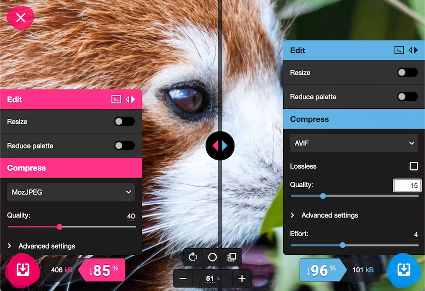

# Форматы изображений: AVIF

<big>AV1 Image File Format (AVIF) - это кодирование, основанное на видеокодеке AV1 с открытым исходным кодом.</big>

<picture>
<source type="image/webp" srcset="https://caniuse.bitsofco.de/image/avif.webp">
<source type="image/png" srcset="https://caniuse.bitsofco.de/image/avif.png">

</picture>

AV1 Image File Format (AVIF) - это кодировка, основанная на видеокодеке AV1 с открытым исходным кодом. AVIF еще [более новый](https://caniuse.com/avif) чем WebP, поддерживается только в Chrome и Opera с 2020 года, в Firefox с 2021 года, а в Safari с 2022 года. Как и WebP, AVIF призван решить все возможные задачи использования растровых изображений в Интернете: GIF-анимация, PNG-прозрачность и улучшенное качество восприятия при меньших размерах файлов, чем JPEG или WebP.

Пока AVIF демонстрирует неплохие промисы. Тестовая схема [https://github.com/Netflix/image_compression_comparison], разработанная компанией Netflix - одним из основателей [Alliance for Open Media](https://aomedia.org/), группы, ответственной за разработку кодека AV1, - показывает [значительное уменьшение размеров файлов](https://netflixtechblog.com/avif-for-next-generation-image-coding-b1d75675fe4) по сравнению с JPEG или WebP. Дополнительные исследования, проведенные [Cloudinary](https://cloudinary.com/blog/contemplating-codec-comparisons) и [командой разработчиков кодеков Chrome](https://storage.googleapis.com/avif-comparison/index.html), положительно оценивают его в сравнении с существующими стандартами кодирования.

Хотя инструментарий относительно ограничен, вы можете и должны [начать экспериментировать с AVIF](https://jakearchibald.com/2020/avif-has-landed/) уже сегодня, как с одной из кодировок, предлагаемых Squoosh:

## Поддержка браузеров {#browser-support}

Если вы задаетесь вопросом, почему мы потратили столько времени на обсуждение JPEG, в то время как AVIF и WebP могут предложить нам более высокое качество и гораздо меньший размер файлов, то это потому, что они, как и любые другие новые кодировки изображений, имеют существенную загвоздку. Поддержка GIF, PNG и JPEG гарантирована во всех браузерах, и так было на протяжении десятилетий. По сравнению с этими старыми форматами изображений AVIF является совершенно новым, и хотя поддержка WebP [отлично](https://caniuse.com/?search=webp) реализована в современных браузерах, она не является гарантированной во всем Интернете.

Как вы можете себе представить, огромное количество времени и усилий было потрачено на разработку новых форматов изображений, призванных улучшить качество и размер передаваемых данных. Такие форматы, как WebP, AVIF и [JPEG XL](https://jpeg.org/jpegxl/) ([не поддерживается ни в одном браузере](https://caniuse.com/jpegxl)), стремятся стать унифицированным решением для растровых изображений в Интернете, как SVG - для векторных. Другие, например JPEG 2000 (поддерживается только в Safari), призваны удовлетворить все те же потребности, что и базовый JPEG, но при этом усовершенствовать методы сжатия, чтобы получить визуально похожее, но гораздо более компактное изображение.

Хотя некоторые из этих новых форматов имеют общее название JPEG, их кодировки так же принципиально отличаются друг от друга, как JavaScript от Java. Браузер, не поддерживающий данную кодировку, вообще не сможет разобрать файл изображения - это как если бы я попросил вас заполнить пиксельную сетку на бумаге на непонятном вам языке. Браузер запросит данные изображения, попытается их разобрать и, потерпев неудачу, отбросит их, так ничего и не отобразив. Источник изображения, который не может отрисоваться вне современных браузеров, будет огромной точкой отказа для нашего контента и для Интернета в целом - неработающее изображение и потерянная пропускная способность для огромного количества пользователей по всему миру. Не стоит жертвовать более жизнеспособным вебом ради более производительного.

Долгое время наш единомышленник `img>` делал использование любого нового формата изображений исключительно затруднительным, каким бы промисом он ни казался. Помните, `` поддерживал только один исходный файл и был гипер-оптимизирован для быстрой передачи этого файла - настолько быстрой, что мы не могли перехватить этот запрос с помощью JavaScript. До недавнего времени единственным приемлемым вариантом было предоставлять всем пользователям совершенно новый тип изображения и запрашивать один из "старых" форматов, когда браузер выдавал ошибку, что приводило к повторной передаче файла после того, как первая была выполнена впустую.

По этой и другим причинам `` в том виде, в котором он существовал десятилетиями, должен был измениться. В следующем модуле, [Отзывчивые изображения](responsive-images.md), вы узнаете о функциях, внесенных в спецификацию HTML для решения этих проблем, и о том, как использовать их в своей повседневной работе.

:material-information-outline: Источник &mdash; [Image formats: AVIF](https://web.dev/learn/images/avif/)
