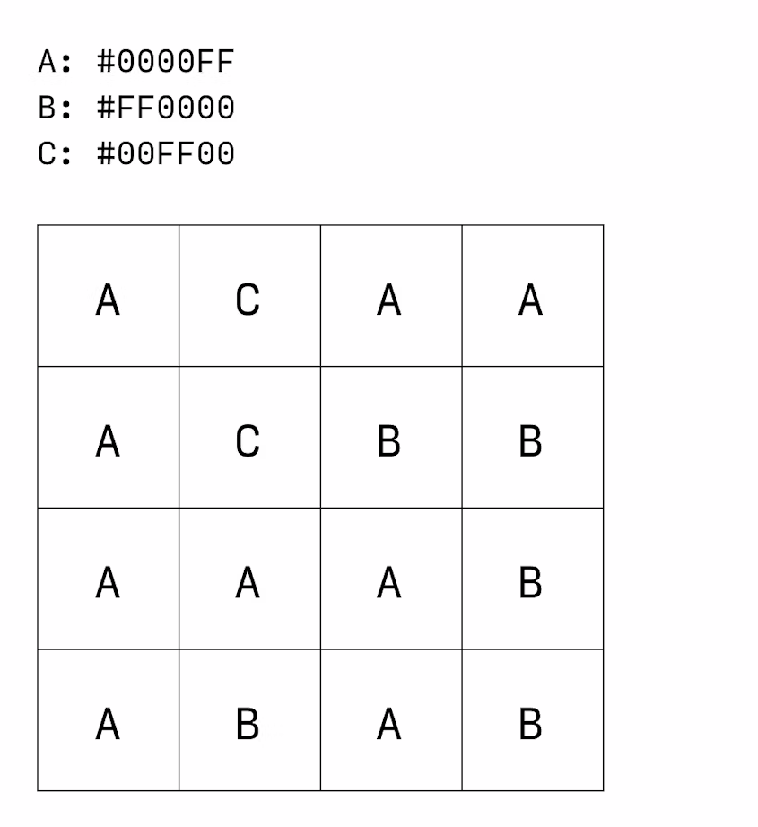
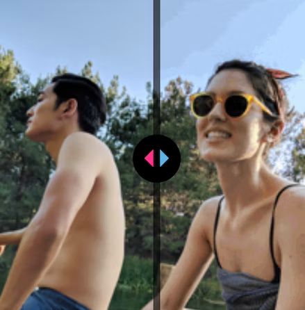
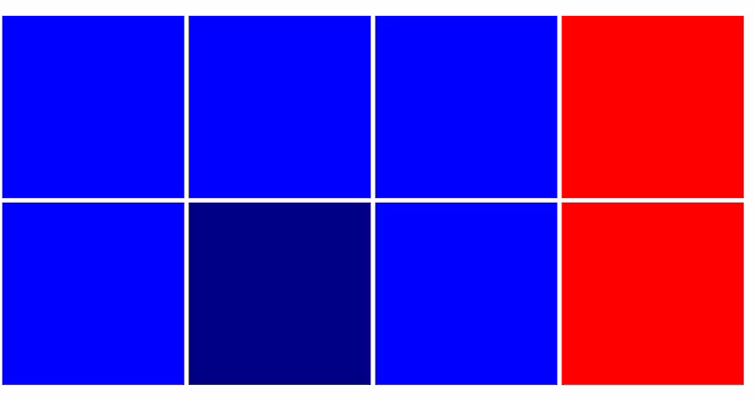
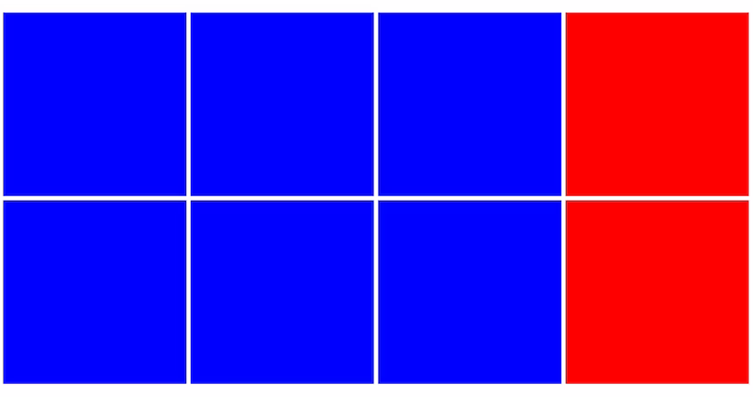

# Форматы изображений: GIF

<big>Понимание формата изображения GIF, а также объяснение принципов кодирования изображений.</big>

Хотя GIF (Graphics Interchange Format) не слишком полезен в современном Интернете, он является хорошим введением в основные концепции кодирования изображений.

GIF можно рассматривать как обертку для данных изображения. Он имеет своего рода область просмотра, называемую "логическим экраном", на которую выводятся отдельные кадры изображения - примерно как слои в документе Photoshop. Именно так в GIF реализована анимация, напоминающая флипбук: на логический экран выводится один кадр, затем его сменяет другой, затем еще один. Конечно, это различие не имеет значения, когда мы имеем дело со статическим GIF, состоящим из одного кадра, выведенного на логический экран.

В GIF используется метод сжатия данных без потерь - вариант алгоритма "[Lempel-Ziv-Welch](https://ru.wikipedia.org/wiki/%D0%90%D0%BB%D0%B3%D0%BE%D1%80%D0%B8%D1%82%D0%BC_%D0%9B%D0%B5%D0%BC%D0%BF%D0%B5%D0%BB%D1%8F_%E2%80%94_%D0%97%D0%B8%D0%B2%D0%B0_%E2%80%94_%D0%92%D0%B5%D0%BB%D1%87%D0%B0)", если вам интересно. В тонкости работы этого алгоритма мы вдаваться не будем, но в общих чертах можно сказать, что он работает примерно так же, как JavaScript, где повторяющиеся строки символов во всем файле сохраняются во внутреннем словаре, чтобы на них можно было ссылаться, а не повторять каждый раз, когда они появляются.

Конечно, этот [алгоритм не так прост](https://giflib.sourceforge.net/whatsinagif/lzw_image_data.html), как paint-by-number. Он снова просматривает сгенерированную таблицу цветовых кодов, чтобы найти повторяющиеся последовательности цветов пикселей, и создает вторую таблицу кодов, на которую можно ссылаться. При этом данные изображения ни в коем случае не теряются - они просто сортируются и реорганизуются таким образом, чтобы их можно было прочитать, не изменяя принципиально.

Хотя формально GIF использует сжатие без потерь, у него есть серьезное ограничение, которое сильно влияет на качество изображений: сохранение изображения в формате GIF всегда приводит к снижению четкости, если только в изображении не используется 256 цветов или меньше.

Каждый кадр, выводимый на логический экран GIF, может содержать не более 256 цветов. GIF также поддерживает "индексную прозрачность", когда прозрачный пиксель ссылается на индекс прозрачного "цвета" в таблице цветов.

Практика сокращения диапазона значений до меньшего, приближенного набора выходных значений называется _квантованием_ - этот термин часто встречается при изучении кодировок изображений. Результаты квантования палитры обычно очевидны:

Чтобы лучше понять этот процесс, вспомните сетку растровых изображений, которую вы смогли воссоздать из моего описания.

На этот раз добавьте к исходному изображению немного больше деталей: еще несколько пикселей, один из которых имеет чуть более темный оттенок синего:

Без какого-либо сжатия, так сказать, можно описать эту сетку следующим образом:

> Первая строка, первый столбец - #0000FF. Первая строка, второй столбец - #0000FF. Строка один, столбец три - #0000FF. Первая строка, четвертый столбец - #FF0000. Вторая строка, первый столбец - #0000FF. Строка два, столбец два - #000085. Строка два, столбец три - #0000FF. Строка два, четвертый столбец - #FF0000.

Используя сжатие данных без потерь и индексацию цветов в GIF, можно описать это следующим образом:

> A: #0000FF, B: #FF0000, C: #000085. Первая строка, столбцы с первого по третий - A. Первая строка, четвертый столбец - B. Вторая строка, первый столбец - A. Вторая строка, второй столбец - C. Вторая строка, третий столбец - A. Вторая строка, четвертый столбец - B.

Это позволяет сократить попиксельное описание в нескольких местах ("столбцы с первого по третий являются...") и сэкономить несколько символов за счет определения повторяющихся цветов в своеобразном словаре. Визуальная достоверность не изменилась. Информация сжата без каких-либо потерь.

Однако, как видите, один-единственный темно-синий пиксель оказывает чрезмерное влияние на размер нашего кодирования. Если бы я ограничился квантованной цветовой палитрой, то ее можно было бы уменьшить еще больше:

> A: #0000FF, B: #FF0000. Первая строка, столбцы с первого по третий - A. Первая строка, четвертый столбец - B. Вторая строка, столбцы с первого по третий - A. Вторая строка, четвертый столбец - B.

К сожалению, в результате экономии этих байтов теряется пиксельная точность.

Разумеется, вы, механизм рендеринга, не знаете этого - детализация темно-синего пикселя не была учтена в том, как я закодировал исходное изображение. Вы отобразили изображение именно так, как я его закодировал, основываясь на нашем общем понимании имеющихся у нас цветов.

Теперь, в этом утрированном примере, сокращение трех цветов до двух дает очевидную разницу в качестве. На более крупном и детальном изображении эффект может быть не столь заметен, но он все равно будет заметен.

При кодировании в формат GIF тонкие градиенты, например тени, становятся пестрыми, а отдельные пиксели выделяются на фоне окружающего пространства:

На практике сочетание сжатия без потерь и квантования палитры означает, что GIF не очень полезен в современной веб-разработке. Сжатие без потерь не позволяет уменьшить размер файла, а уменьшение палитры означает очевидное снижение качества.

В конечном счете, GIF является эффективным форматом только для кодирования простых изображений, в которых уже используются ограниченные цветовые палитры, жесткие края, а не сглаживание, и сплошные цвета, а не градиенты - все те случаи, для которых гораздо лучше подходят другие форматы. Более компактный и многофункциональный PNG часто является лучшим выбором для растровых изображений, хотя оба формата значительно уступают SVG по размеру файла и визуальной достоверности для таких случаев использования, как пиктограммы или линейный рисунок, где векторный формат является лучшим. Наиболее распространенным современным вариантом использования GIF является анимация, однако для этой цели существуют гораздо более эффективные и доступные современные видеоформаты.

:material-information-outline: Источник &mdash; [Image formats: GIF](https://web.dev/learn/images/gif/)
